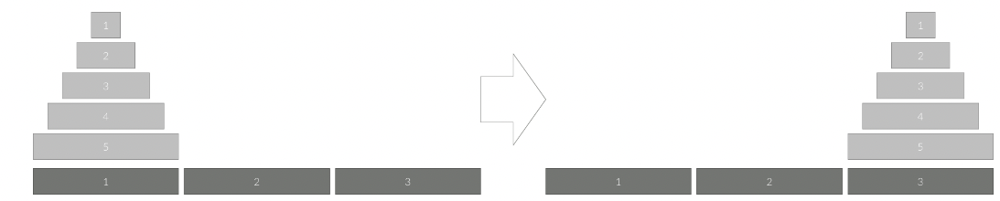

> 재귀함수 주제에 해당하는 문제입니다. 사용한 언어는 **_JavaScript(NodeJS)_** 입니다.

## 하노이 탑 (문제번호 : 1914)

#### \* 문제 : 세 개의 장대가 있고 첫 번째 장대에는 반경이 서로 다른 n개의 원판이 쌓여 있다. 각 원판은 반경이 큰 순서대로 쌓여있다. 이제 수도승들이 다음 규칙에 따라 첫 번째 장대에서 세 번째 장대로 옮기려 한다.

1. 한 번에 한 개의 원판만을 다른 탑으로 옮길 수 있다.
2. 쌓아 놓은 원판은 항상 위의 것이 아래의 것보다 작아야 한다.
   이 작업을 수행하는데 필요한 이동 순서를 출력하는 프로그램을 작성하라. 단, 이동 횟수는 최소가 되어야 한다.

<br/>

#### 아래 그림은 원판이 5개인 경우의 예시이다.



- 입력 : 첫째 줄에 첫 번째 장대에 쌓인 원판의 개수 N (1 ≤ N ≤ 100)이 주어진다.

- 출력 : 첫째 줄에 옮긴 횟수 K를 출력한다. N이 20 이하인 입력에 대해서는 두 번째 줄부터 수행 과정을 출력한다. 두 번째 줄부터 K개의 줄에 걸쳐 두 정수 A B를 빈칸을 사이에 두고 출력하는데, 이는 A번째 탑의 가장 위에 있는 원판을 B번째 탑의 가장 위로 옮긴다는 뜻이다. N이 20보다 큰 경우에는 과정은 출력할 필요가 없다.

```javascript
const fs = require('fs')
const N = parseInt(fs.readFileSync(0).toString().trim())
let moves = []

function hanoi(n, start, end, via) {
  if (n === 1) {
    moves.push(`${start} ${end}`)
    return
  }
  hanoi(n - 1, start, via, end)
  moves.push(`${start} ${end}`)
  hanoi(n - 1, via, end, start)
}

console.log((2n ** BigInt(N) - 1n).toString())

if (N <= 20) {
  hanoi(N, 1, 3, 2)
  console.log(moves.join('\n'))
}
```

<br/>

#### \* 문제 풀이

1. 하노이 탑 알고리즘을 구현한 함수입니다. 여기서 n은 원판의 수, start는 시작 장대, end는 목표 장대, via는 중간 장대를 나타냅니다.

```javascript
function hanoi(n, start, end, via) {

```

2. 원판이 하나만 남으면, 그 원판을 start에서 end로 이동합니다.

```javascript
if (n === 1) {
    moves.push(`${start} ${end}`)
    return
  }

}
```

3. 곱셈을 누적해서 저장하는 방식으로 문제를 풀이해줍니다. result라는 값을 저장해주는 변수를 만들고, \*=를 사용하여 ifmf result에 곱해 누적해줍니다.

```javascript
hanoi(n - 1, start, via, end) // n-1개의 원판을 start에서 via로 이동합니다. 이 때 end를 중간 장대로 사용합니다.
moves.push(`${start} ${end}`) //  현재 원판을 start에서 end로 이동하고, 이동 정보를 moves 배열에 추가합니다.
hanoi(n - 1, via, end, start) // n-1개의 원판을 via에서 end로 이동합니다. 이 때 start를 중간 장대로 사용합니다.
```

4. 전체 이동 횟수를 출력합니다. 하노이 탑의 이동 횟수는 2^n - 1로 주어지며, 여기서는 BigInt를 사용해 큰 수를 정확하게 계산합니다.

```javascript
console.log((2n ** BigInt(N) - 1n).toString())
```

5. 문제에서 N이 20 이하인 경우에만 이동 과정을 출력해야 하므로 이 조건을 체크합니다.

```javascript
if (N <= 20) {
  hanoi(N, 1, 3, 2)
  console.log(moves.join('\n'))
}
```

결과 : `성공`

<br/>
<br/>

- 백준코딩 하노이 탑, 문제번호 : 1914번 링크

[<https://www.acmicpc.net/problem/1914>](https://www.acmicpc.net/problem/1914)
