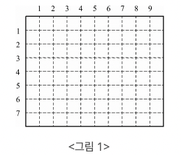
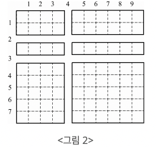

> 수학 주제에 해당하는 문제입니다. 사용한 언어는 **_JavaScript(NodeJS)_** 입니다.

## 종이자르기 (문제번호 : 2628)

#### \* 문제 : 아래 <그림 1>과 같이 직사각형 모양의 종이가 있다. 이 종이는 가로방향과 세로 방향으로 1㎝마다 점선이 그어져 있다. 가로 점선은 위에서 아래로 1번부터 차례로 번호가 붙어 있고, 세로 점선은 왼쪽에서 오른쪽으로 번호가 붙어 있다.



#### 점선을 따라 이 종이를 칼로 자르려고 한다. 가로 점선을 따라 자르는 경우는 종이의 왼쪽 끝에서 오른쪽 끝까지, 세로 점선인 경우는 위쪽 끝에서 아래쪽 끝까지 한 번에 자른다. 예를 들어, <그림 1>의 가로 길이 10㎝이고 세로 길이 8㎝인 종이를 3번 가로 점선, 4번 세로 점선, 그리고 2번 가로 점선을 따라 자르면 <그림 2>와 같이 여러 개의 종이 조각으로 나뉘게 된다. 이때 가장 큰 종이 조각의 넓이는 30㎠이다.



#### 입력으로 종이의 가로 세로 길이, 그리고 잘라야할 점선들이 주어질 때, 가장 큰 종이 조각의 넓이가 몇 ㎠인지를 구하는 프로그램을 작성하시오.

- 입력 : 첫줄에는 종이의 가로와 세로의 길이가 차례로 자연수로 주어진다. 가로와 세로의 길이는 최대 100㎝이다. 둘째 줄에는 칼로 잘라야하는 점선의 개수가 주어진다. 셋째 줄부터 마지막 줄까지 한 줄에 점선이 하나씩 아래와 같은 방법으로 입력된다. 가로로 자르는 점선은 0과 점선 번호가 차례로 주어지고, 세로로 자르는 점선은 1과 점선 번호가 주어진다. 입력되는 두 숫자 사이에는 빈 칸이 하나씩 있다.

- 출력 : 첫째 줄에 가장 큰 종이 조각의 넓이를 출력한다. 단, 넓이의 단위는 출력하지 않는다.

```javascript
const fs = require('fs')
const inputData = fs.readFileSync(0).toString().trim().split('\n')
const [x, y] = inputData[0].split(' ').map(Number)
const slice = parseInt(inputData[1])

const horizontal = [0, y]
const vertical = [0, x]

for (let i = 2; i <= slice + 1; i++) {
  const [direction, position] = inputData[i].split(' ').map(Number)
  if (direction === 0) {
    horizontal.push(position)
  } else {
    vertical.push(position)
  }
}

horizontal.sort((a, b) => a - b)
vertical.sort((a, b) => a - b)

let maxArea = 0

for (let i = 1; i < horizontal.length; i++) {
  for (let j = 1; j < vertical.length; j++) {
    const area =
      (horizontal[i] - horizontal[i - 1]) * (vertical[j] - vertical[j - 1])
    maxArea = Math.max(maxArea, area)
  }
}

console.log(maxArea)
```

<br/>

#### \* 문제 풀이

1. 여기서 입력받은 3번째 줄 데이터를 확인하여 가로로 잘라야하는지 세로로 잘라야하는지 조건문으로 구분해줍니다. direction이 0이 입력되어있다면 가로이기 때문에 horizontal에 데이터를 push 해줍니다. 예를들어 입력 데이터가 0,4라면 const horizontal = [0, 4]가 되고 다음 데이터가 0, 7이라면 const horizontal = [0, 4, 7] 로 입력 받아집니다. vertical의 경우도 마찬가지 입니다.
   \*\* [0, y],[0, x]의 0은 종이의 시작점을 나타냅니다.

```javascript
const horizontal = [0, y]
const vertical = [0, x]

for (let i = 2; i <= slice + 1; i++) {
  const [direction, position] = inputData[i].split(' ').map(Number)
  if (direction === 0) {
    horizontal.push(position)
  } else {
    vertical.push(position)
  }
}
```

2. horizontal과 vertical 배열을 오름차순으로 정렬합니다. 이 정렬은 나중에 넓이를 계산할 때 두 점선 사이의 거리를 쉽게 구하기 위함입니다.

```javascript
horizontal.sort((a, b) => a - b)
vertical.sort((a, b) => a - b)
```

3. 2번에서 말한것 처럼 배열을 오름차순으로 정렬해줬기 때문에 잘린 면적을 현재 점선과 이전 점선 사이의 거리를 곱하여 구한 뒤, maxArea = Math.max(maxArea, area)을 통해 area와 현재까지 알고 있는 가장 큰 면적보다 비교하여 더 크다면, maxArea에 계속 업데이트해줍니다. let을 사용한 이유는 이 처럼 이 변수의 값이 계속해서 업데이트 될 가능성이 있기 때문입니다.

```javascript
let maxArea = 0 //가장 큰 종이 조각의 넓이를 저장할 변수입니다.

for (let i = 1; i < horizontal.length; i++) {
  // 가로 방향의 점선들을 순회하는 루프입니다.
  // 첫 번째 점선(horizontal[0])은 세종이의 시작점이 저장되어 있어 [1]부터 시작해줍니다.
  for (let j = 1; j < vertical.length; j++) {
    // 세로 방향의 점선들을 순회하는 루프입니다.
    const area =
      (horizontal[i] - horizontal[i - 1]) * (vertical[j] - vertical[j - 1])
    maxArea = Math.max(maxArea, area)
  }
}

console.log(maxArea)
```

결과 : `성공`

<br/>
<br/>

- 백준코딩 종이자르기, 문제번호 : 2628번 링크

[<https://www.acmicpc.net/problem/2628>](https://www.acmicpc.net/problem/2628)
