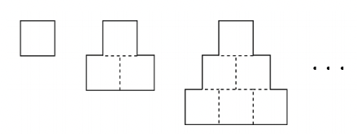
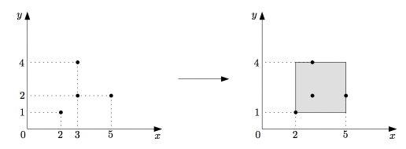

> 백준 기하: 직사각형과 삼각형 단계 중 1번부터 8번 문제에 대한 풀이입니다. 사용한 언어는 **_JavaScript(NodeJS)_** 입니다.

## 단계 1. 직사각형 (문제번호 : 27323)

#### \* 문제 : 정수 A, B 가 주어진다. 세로 길이가 A cm, 가로 길이가 B cm 인 아래와 같은 직사각형의 넓이를 cm2 단위로 구하시오.

- 입력 : 표준 입력에 다음과 같은 형태로 입력이 주어진다.<br/>
  A<br/>
  B<br/>

- 출력 : 세로 길이가 A cm, 가로 길이가 B cm인 직사각형의 넓이를 cm2 단위로 구하고, 단위 (cm2)를 생략하여 출력한다.
- 제한 <br/>
  - 1 ≦ A ≦ 100.<br/>
  - 1 ≦ B ≦ 100.<br/>
  - A, B 는 정수이다.<br/>

```javascript
const fs = require('fs')
const inputData = fs.readFileSync(0).toString().trim().split('\n')
const A = parseInt(inputData[0])
const B = parseInt(inputData[1])

console.log(A * B)
```

결과 : `성공`

## 단계 2. 직사각형에서 탈출 (문제번호 : 1085)

#### \* 문제 : 한수는 지금 (x, y)에 있다. 직사각형은 각 변이 좌표축에 평행하고, 왼쪽 아래 꼭짓점은 (0, 0), 오른쪽 위 꼭짓점은 (w, h)에 있다. 직사각형의 경계선까지 가는 거리의 최솟값을 구하는 프로그램을 작성하시오.

- 입력 : 첫째 줄에 x, y, w, h가 주어진다.

- 출력 : 첫째 줄에 문제의 정답을 출력한다.

```javascript
const fs = require('fs')
const inputData = fs.readFileSync(0).toString().trim().split(' ')
const [x, y, w, h] = inputData.map(input => parseInt(input))

console.log(Math.min(x, w - x, h - y, y))
```

<br/>

#### \* 문제 풀이

1. 현수의 위치(x,y)인 각각의 좌표에서 원점에 있는 곳까지의 거리, 각각의 좌표에서 (w,h)좌표 까지의 거리 중 최소값을 출력해주면 됩니다.

   <br/>

결과 : `성공`

## 단계 3. 네 번째 점 (문제번호 : 3009)

#### \* 문제 : 세 점이 주어졌을 때, 축에 평행한 직사각형을 만들기 위해서 필요한 네 번째 점을 찾는 프로그램을 작성하시오.

- 입력 : 세 점의 좌표가 한 줄에 하나씩 주어진다. 좌표는 1보다 크거나 같고, 1000보다 작거나 같은 정수이다.
- 출력 : 직사각형의 네 번째 점의 좌표를 출력한다.

```javascript
const fs = require('fs')
const inputData = fs.readFileSync(0).toString().trim().split('\n')

let p = []
let q = []

for (let i = 0; i < 3; i++) {
  const [x, y] = inputData[i].split(' ')
  p.push(x)
  q.push(y)
}
let x = p[0] ^ p[1] ^ p[2]
let y = q[0] ^ q[1] ^ q[2]

console.log(`${x} ${y}`)
```

<br/>

#### \* 문제 풀이

1. 문제에서 직사각형을 만들기 위한 네번째 점을 찾아야한다고 했습니다. 직사각형이 되기 위해서는 첫번째, 두번째, 세번째, 네번째 점들의 각각 (x,y) 좌표의 수 중 두 개의 수가 반복되어야 합니다. 즉 주어진 3개의 점들 중에서 반복되지 않는 하나의 수를 x좌표끼리 비교해서 찾고, y좌표끼리 비교해서 찾으면 됩니다.

2. p에는 3개의 점들 중 x좌표에 해당되는 수들을 배열로 만들고, q에는 y좌표에 해당하는 수들을 배열로 만들었습니다.

```javascript
let p = []
let q = []
```

3. 만든 각각의 p,q배열에서 세 숫자 중 다른 한 숫자를 골라내기 위해 XOR 연산을 사용해서 다른 숫자를 찾아내줍니다. XOR은 비트 연산자 중 하나로, 두 입력 값이 서로 다를 때 1(True)을 반환하고, 서로 같을 때 0(False)을 반환하는 특징이 있습니다.<br/>
   XOR의 특징을 나열하면 아래와 같습니다.

- 교환법칙: A XOR B는 B XOR A와 같습니다. 숫자의 순서를 바꾸어도 결과는 같습니다.

- 결합법칙: (A XOR B) XOR C는 A XOR (B XOR C)와 같습니다. 즉, 연산 순서를 바꾸어도 결과는 같습니다.

- 자기 자신과의 XOR: 어떤 수 A에 대해서 A XOR A는 0입니다. 즉, 자기 자신과의 XOR 연산 결과는 0입니다.

- 0과의 XOR: 어떤 수 A에 대해서 A XOR 0은 A입니다. 즉, 0과의 XOR 연산 결과는 자기 자신입니다.

예시를 들어 설명하면, 5^5^2가 주어졌을때 5^5는 같은 수(자기 자신과의 XOR)이므로 0을 반환하고, 0^2를 비교하면(0과의 XOR)이므로 2가 나옵니다. 만약, 5^2^5라고 하더라도 교환법칙이 적용되어 5^5^2가 되기 때문에 결과는 같게 됩니다.

```javascript
let x = p[0] ^ p[1] ^ p[2]
let y = q[0] ^ q[1] ^ q[2]
```

결과 : `성공`
<br/>

## 단계 4. 수학은 체육과목 입니다 (문제번호 : 15894)

#### \* 문제 : 성원이는 수학을 정말 못 하는 고등학생이다. 수학을 못하는 대신 근성과 팔 힘이 뛰어난 성원이는 수학 시험에서 수학 지식을 사용하지 않고 근성과 체력을 사용해 문제를 푼다. 지난 시험에서는 아래 사진에 나와있는 문제를 근성과 체력을 사용해 열심히 풀었지만 사진에서 볼 수 있듯이 틀려버리고 말았다! 결국 이 문제는 틀려버렸지만 성원이는 여전히 자신의 체력에 강한 자신감을 갖고 있다. 어떤 어려운 문제가 나와도 이런 식으로 근성과 체력을 사용하면 다 풀 수 있으니 이 방법은 최고의 방법이라고 생각하고 있다. 성원이의 친구 형석이는 근성과 체력으로 수학 문제를 푸는 것은 굉장히 무식한 방법이라고 생각한다. 형석이는 수학을 공부하면 문제를 훨씬 빨리 풀 수 있다는 것을 알려주기 위해 위 사진에 나와있는 문제를 갖고 성원이와 퀴즈 내기를 하기로 했다. 위 사진의 문제를 다시 정리하면 아래와 같다.<br/>

#### 한 변의 길이가 1인 정사각형을 아래 그림과 같이 겹치지 않게 빈틈없이 계속 붙여 나간다. 가장 아랫부분의 정사각형이 n개가 되었을 때, 실선으로 이루어진 도형의 둘레의 길이를 구하시오."



#### 가장 아랫부분의 정사각형 개수가 주어지면 그에 해당하는 답을 출력하는 프로그램을 만들어 형석이를 도와주자!

- 입력 : 첫 번째 줄에 가장 아랫부분의 정사각형 개수 n이 주어진다. (1 ≤ n ≤ 10^9)

- 출력 : 첫 번째 줄에 형석이가 말해야 하는 답을 출력한다.

```javascript
const fs = require('fs')
const N = parseInt(fs.readFileSync(0).toString().trim())

console.log(4 * N)
```

<br/>

#### \* 문제 풀이

1. 규칙을 찾아주면 됩니다.<br/>
   N = 1<br/>
   윗면 = 1 x 1<br/>
   아랫면 = 1<br/>
   옆면 = 1 x 2<br/>
   N=2<br/>
   윗면 = 1 x 2<br/>
   아랫면 = 2<br/>
   옆면 = 2 x 2<br/>
   N=3<br/>
   윗면 = 1 x 3<br/>
   아랫면 = 3<br/>
   옆면 = 3 x 2<br/>
   규칙 : 정사각형이 N개 일때, 윗면 = 1 x N, 아랫면 = N, 옆면 = N x 2이므로 모든 면을 더하면 총 4 x N이 나옵니다.
   <br/>
   <br/>

결과 : `성공`

## 단계 5. 대지 (문제번호 : 9063)

#### \* 문제 : 임씨는 1950 년 한국전쟁으로 많은 손해를 본 사람들 중 하나다. 전쟁 통에 손해보지 않은 사람이 어디 있을까 만은 그는 6.25 가 일어나기 전만 해도 충청도 지방에 넓은 대지를 소유한 큰 부자였다. 전쟁이 나자 임씨는 땅문서와 값 나가는 것들만 챙겨서 일본으로 피난을 가지만 피난 중에 그만 땅문서를 잃어버리고 만다. 전쟁이 끝난 후에 임씨의 땅은 이미 다른 사람들의 논밭이 되어 있었고, 임씨는 땅을 되찾으려 했지만 문서가 없으니 생떼 쓰는 것과 다를 바 없었다. 이러다가 임씨는 길바닥에 나앉게 생겼다. 이때, 임씨에게 좋은 생각이 떠올랐으니 바로 자신이 습관처럼 땅 깊숙이 뭔가 표식을 해놓았던 사실이다. 임씨는 한적할 때마다 자신의 논밭을 거닐다가 땅속 깊은 곳에 자신의 이름이 씌어진 옥구슬을 묻어놓았던 것이다. 즉, 어떤 지점에서 그의 이름이 적힌 옥구슬이 나온다면 그 지점은 예전에 임씨의 땅이었다는 것을 증명하는 것이다. 임씨는 즉시 민사소송을 통해 자신의 땅을 찾고자 했고 논리적인 근거를 들어 옥구슬이 나오는 지점이 원래 자신의 땅의 한 지점이었다는 것을 주장하여 결국 담당판사를 설득하는 데에 성공하였다. 담당판사는 다음과 같은 판결을 내렸다. “ 6.25 이전의 개인소유 대지들은 99%가 남북, 동서 방향으로 평행한 직사각형 모양이었으므로, 임씨의 이름이 새겨진 옥구슬이 나오는 모든 지점을 포함하는 가장 작은 남북, 동서 방향으로 평행한 변을 갖는 직사각형의 대지를 임씨의 소유로 인정한다.” 임씨는 많은 손해를 보는 셈이지만 더 이상을 요구할 만한 근거가 없었기 때문에 이 판결을 따르기로 했다. 임씨의 이름이 새겨진 옥구슬의 위치 N 개가 주어질 때에, 임씨에게 돌아갈 대지의 넓이를 계산하는 프로그램을 작성하시오. 단, 옥구슬의 위치는 2 차원 정수 좌표로 주어지고 옥구슬은 같은 위치에 여러 개가 발견될 수도 있으며, x 축의 양의방향을 동쪽, y 축의 양의방향을 북쪽이라고 가정한다.



#### 예를 들어 위와 같이 (2, 1), (3, 2), (5, 2), (3, 4) 네 점에서 옥구슬을 발견하였다면, 임씨에게 돌아갈 대지는 (2, 1), (5, 1), (2, 4), (5, 4)를 네 꼭짓점으로 하는 직사각형이며, 넓이는 (5 - 2) × (4 - 1) = 9 가 된다.

- 입력 : 첫째 줄에는 점의 개수 N (1 ≤ N ≤ 100,000) 이 주어진다. 이어지는 N 줄에는 각 점의 좌표가 두 개의 정수로 한 줄에 하나씩 주어진다. 각각의 좌표는 -10,000 이상 10,000 이하의 정수이다.
- 출력 : 첫째 줄에 N 개의 점을 둘러싸는 최소 크기의 직사각형의 넓이를 출력하시오.

```javascript
const fs = require('fs')
const inputData = fs.readFileSync(0).toString().trim().split('\n')
const N = parseInt(inputData[0])
let p = []
let q = []
for (i = 1; i < N + 1; i++) {
  if (N <= 1) {
    console.log('0')
  } else {
    const [x, y] = inputData[i].split(' ')
    p.push(x)
    q.push(y)
  }
}

if (N > 1) {
  console.log(
    (Math.max(...p) - Math.min(...p)) * (Math.max(...q) - Math.min(...q)),
  )
}
```

<br/>

#### \* 문제 풀이

1. 이 문제 역시 규칙을 찾아주면 됩니다. 입력으로 주어진 좌표들 중 x좌표중에 가장 큰값에서 가장 작은 값을 뺀 수와 주어진 y좌표의 수도 가장 큰값에서 가장 작은 값을 뺀 수를 곱해주면 됩니다.
   <br/>
   <br/>

결과 : `성공`

## 단계 6. 삼각형 외우기 (문제번호 : 10101)

#### \* 문제 : 창영이는 삼각형의 종류를 잘 구분하지 못한다. 따라서 프로그램을 이용해 이를 외우려고 한다. 삼각형의 세 각을 입력받은 다음,

- 세 각의 크기가 모두 60이면, Equilateral
- 세 각의 합이 180이고, 두 각이 같은 경우에는 Isosceles
- 세 각의 합이 180이고, 같은 각이 없는 경우에는 Scalene
- 세 각의 합이 180이 아닌 경우에는 Error

#### 를 출력하는 프로그램을 작성하시오.

- 입력 : 총 3개의 줄에 걸쳐 삼각형의 각의 크기가 주어진다. 모든 정수는 0보다 크고, 180보다 작다.

- 출력 : 문제의 설명에 따라 Equilateral, Isosceles, Scalene, Error 중 하나를 출력한다.

```javascript
const fs = require('fs')
const inputData = fs.readFileSync(0).toString().trim().split('\n')
const A = parseInt(inputData[0])
const B = parseInt(inputData[1])
const C = parseInt(inputData[2])

if (A + B + C !== 180) {
  console.log('Error')
} else {
  if (A === B && B === C) {
    console.log('Equilateral')
  } else if (A === B || B === C || A === C) {
    console.log('Isosceles')
  } else {
    console.log('Scalene')
  }
}
```

결과 : `성공`

## 단계 7. 삼각형과 세 변 (문제번호 : 5073)

#### \* 문제 : 삼각형의 세 변의 길이가 주어질 때 변의 길이에 따라 다음과 같이 정의한다.

- Equilateral : 세 변의 길이가 모두 같은 경우
- Isosceles : 두 변의 길이만 같은 경우
- Scalene : 세 변의 길이가 모두 다른 경우

#### 단 주어진 세 변의 길이가 삼각형의 조건을 만족하지 못하는 경우에는 "Invalid" 를 출력한다. 예를 들어 6, 3, 2가 이 경우에 해당한다. 가장 긴 변의 길이보다 나머지 두 변의 길이의 합이 길지 않으면 삼각형의 조건을 만족하지 못한다. 세 변의 길이가 주어질 때 위 정의에 따른 결과를 출력하시오.

- 입력 : 각 줄에는 1,000을 넘지 않는 양의 정수 3개가 입력된다. 마지막 줄은 0 0 0이며 이 줄은 계산하지 않는다.
- 출력 : 각 입력에 맞는 결과 (Equilateral, Isosceles, Scalene, Invalid) 를 출력하시오.

```javascript
const fs = require('fs')
const inputData = fs.readFileSync(0).toString().trim().split('\n')

for (let line of inputData) {
  let [A, B, C] = line.split(' ').map(input => parseInt(input))

  if (A === 0 && B === 0 && C === 0) {
    break
  }
  let sides = [A, B, C].sort((a, b) => a - b)

  if (sides[2] >= sides[0] + sides[1]) {
    console.log('Invalid')
  } else if (A === B && B === C) {
    console.log('Equilateral')
  } else if (A === B || B === C || A === C) {
    console.log('Isosceles')
  } else {
    console.log('Scalene')
  }
}
```

#### \* 문제 풀이

1. 삼각형의 조건을 만족하는 조건을 주기위해, Array.prototype.sort() 함수를 사용하여, 배열 내의 인자들을 오름차순으로 정렬해줍니다.

```javascript
let sides = [A, B, C].sort((a, b) => a - b)
```

결과 : `성공`
<br/>

## 단계 8. 세 막대 (문제번호 : 14215)

#### \* 문제 : 영선이는 길이가 a, b, c인 세 막대를 가지고 있고, 각 막대의 길이를 마음대로 줄일 수 있다. 영선이는 세 막대를 이용해서 아래 조건을 만족하는 삼각형을 만들려고 한다.

- 각 막대의 길이는 양의 정수이다
- 세 막대를 이용해서 넓이가 양수인 삼각형을 만들 수 있어야 한다.
- 삼각형의 둘레를 최대로 해야 한다.

#### a, b, c가 주어졌을 때, 만들 수 있는 가장 큰 둘레를 구하는 프로그램을 작성하시오.

- 입력 : 첫째 줄에 a, b, c (1 ≤ a, b, c ≤ 100)가 주어진다.

- 출력 : 첫째 줄에 만들 수 있는 가장 큰 삼각형의 둘레를 출력한다.

```javascript
const fs = require('fs')
const [a, b, c] = parseInt(fs.readFileSync(0).toString().trim().split(' ')).map(
  input => parseInt(input),
)
let sides = [a, b, c].sort((a, b) => b - a)

if (sides[0] >= sides[1] + sides[2]) {
  sides[0] = sides[1] + sides[2] - 1
}

console.log(sides[0] + sides[1] + sides[2])
```

<br/>

#### \* 문제 풀이

1. 세 변의 길이를 배열에 넣고 내림차순으로 정렬해줍니다.

```javascript
let sides = [A, B, C].sort((a, b) => a - b)
```

2. 단계 7에서 나온 삼각형이 되는 조건처럼 가장 긴 변이 다른 두 변의 합보다 크면 가장 긴 변의 길이를 줄이는 코드를 작성해줍니다.

```javascript
if (sides[0] >= sides[1] + sides[2]) {
  sides[0] = sides[1] + sides[2] - 1
}
```

결과 : `성공`
<br/>
<br/>

- 백준코딩 단계 별 풀어보기 Step10 기하: 직사각형과 삼각형 링크

  [<https://www.acmicpc.net/step/50>](https://www.acmicpc.net/step/50)
