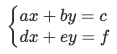

> 백준 브루트 포스 단계 중 1번부터 6번 문제에 대한 풀이입니다. 사용한 언어는 **_JavaScript(NodeJS)_** 입니다.
> 부르트 포스 알고리즘 설계 기법 중 하나로 "무차별 대입" 또는 "완전 탐색"을 의미합니다. 알고리즘의 종류와 개념에 대한 설명은 저의 blog의 포스팅 된 글을 통해 참고 할 수 있습니다.[알고리즘(Algorithm) 종류 및 개념] (https://ellajang.github.io/algorithm/AlgorithmType/)

## 단계 1. 블랙잭 (문제번호 : 2798)

#### \* 문제 : 카지노에서 제일 인기 있는 게임 블랙잭의 규칙은 상당히 쉽다. 카드의 합이 21을 넘지 않는 한도 내에서, 카드의 합을 최대한 크게 만드는 게임이다. 블랙잭은 카지노마다 다양한 규정이 있다. 한국 최고의 블랙잭 고수 김정인은 새로운 블랙잭 규칙을 만들어 상근, 창영이와 게임하려고 한다. 김정인 버전의 블랙잭에서 각 카드에는 양의 정수가 쓰여 있다. 그 다음, 딜러는 N장의 카드를 모두 숫자가 보이도록 바닥에 놓는다. 그런 후에 딜러는 숫자 M을 크게 외친다. 이제 플레이어는 제한된 시간 안에 N장의 카드 중에서 3장의 카드를 골라야 한다. 블랙잭 변형 게임이기 때문에, 플레이어가 고른 카드의 합은 M을 넘지 않으면서 M과 최대한 가깝게 만들어야 한다. N장의 카드에 써져 있는 숫자가 주어졌을 때, M을 넘지 않으면서 M에 최대한 가까운 카드 3장의 합을 구해 출력하시오.

- 입력 : 첫째 줄에 카드의 개수 N(3 ≤ N ≤ 100)과 M(10 ≤ M ≤ 300,000)이 주어진다. 둘째 줄에는 카드에 쓰여 있는 수가 주어지며, 이 값은 100,000을 넘지 않는 양의 정수이다. 합이 M을 넘지 않는 카드 3장을 찾을 수 있는 경우만 입력으로 주어진다.

- 출력 : 첫째 줄에 M을 넘지 않으면서 M에 최대한 가까운 카드 3장의 합을 출력한다.

```javascript
const fs = require('fs')
const inputData = fs.readFileSync(0).toString().trim().split('\n')
const [N, M] = inputData[0].split(' ').map(Number)
const cards = inputData[1].split(' ').map(Number)

let maxSum = 0

for (i = 0; i < N; i++) {
  for (let j = i + 1; j < N; j++) {
    for (let k = j + 1; k < N; k++) {
      let sum = cards[i] + cards[j] + cards[k]
      if (sum <= M && sum > maxSum) {
        maxSum = sum
      }
    }
  }
}
console.log(maxSum)
```

<br/>

#### \* 문제 풀이

1. sum <= M : 플레이어가 선택한 세 카드의 합계(sum)는 M보다 크지 않아야 합니다. 이 규칙은 블랙잭 게임의 규칙에 따라, 합계가 M을 초과하면 안 되기 때문입니다. sum > maxSum : 현재까지 발견한 합계(sum)가 이전에 발견한 가장 큰 합계(maxSum)보다 커야 합니다. 이는 M을 넘지 않는 한에서 가능한 한 M에 가깝게 만들기 위한 조건입니다

```javascript
if (sum <= M && sum > maxSum) {
  maxSum = sum
}
```

결과 : `성공`

## 단계 2. 분해합 (문제번호 : 2231)

#### \* 문제 : 어떤 자연수 N이 있을 때, 그 자연수 N의 분해합은 N과 N을 이루는 각 자리수의 합을 의미한다. 어떤 자연수 M의 분해합이 N인 경우, M을 N의 생성자라 한다. 예를 들어, 245의 분해합은 256(=245+2+4+5)이 된다. 따라서 245는 256의 생성자가 된다. 물론, 어떤 자연수의 경우에는 생성자가 없을 수도 있다. 반대로, 생성자가 여러 개인 자연수도 있을 수 있다. 자연수 N이 주어졌을 때, N의 가장 작은 생성자를 구해내는 프로그램을 작성하시오.

- 입력 : 첫째 줄에 자연수 N(1 ≤ N ≤ 1,000,000)이 주어진다.

- 출력 : 첫째 줄에 답을 출력한다. 생성자가 없는 경우에는 0을 출력한다.

```javascript
const fs = require('fs')
const N = Number(fs.readFileSync(0).toString().trim())

let result = 0

for (let i = 1; i < N; i++) {
  let num = i
  let sum = i
  while (num !== 0) {
    sum += num % 10
    num = Math.floor(num / 10)
  }
  if (sum === N) {
    result = i
    break
  }
}

console.log(result)
```

<br/>

#### \* 문제 풀이

1. 해당 부분에서 num의 각 자리수를 sum에 더하는 작업을 수행합니다. 예를들어 예제에서 나온 것처럼 출력값인 198이 num이였을때, 초기 num: 198, sum: 198이 됩니다. 첫 번째 루프에서, sum에 num의 일의 자리 수(198 % 10 = 8)를 더하고, num은 일의 자리를 제거합니다 (Math.floor(198 / 10) = 19). 이후 num: 19, sum: 198+8 = 206이 됩니다. 두 번째 루프에서, sum에 num의 일의 자리 수(19 % 10 = 9)를 더하고, num은 일의 자리를 제거합니다 (Math.floor(19 / 10) = 1). 이후 num: 1, sum: 206 + 9 = 215가 됩니다. 세 번째 루프에서, sum에 num의 일의 자리 수(1 % 10 = 1)를 더하고, num은 일의 자리를 제거합니다 (Math.floor(1 / 10) = 0). 이후 num: 0, sum: 216이 됩니다. 입력값인 N과 일치하므로 M은 198이 됩니다.

```javascript
while (num !== 0) {
  sum += num % 10
  num = Math.floor(num / 10)
}
```

   <br/>

결과 : `성공`

## 단계 3. 수학은 비대면강의입니다 (문제번호 : 19532)

#### \* 문제 : 수현이는 4차 산업혁명 시대에 살고 있는 중학생이다. 코로나 19로 인해, 수현이는 버추얼 학교로 버추얼 출석해 버추얼 강의를 듣고 있다. 수현이의 버추얼 선생님은 문자가 2개인 연립방정식을 해결하는 방법에 대해 강의하고, 다음과 같은 문제를 숙제로 냈다.

- 다음 연립방정식에서 x와 y의 값을 계산하시오.
  

#### 4차 산업혁명 시대에 숙제나 하고 앉아있는 것보다 버추얼 친구들을 만나러 가는 게 더 가치있는 일이라고 생각했던 수현이는 이런 연립방정식을 풀 시간이 없었다. 다행히도, 버추얼 강의의 숙제 제출은 인터넷 창의 빈 칸에 수들을 입력하는 식이다. 각 칸에는 -999 이상 999 이하의 정수만 입력할 수 있다. 수현이가 버추얼 친구들을 만나러 버추얼 세계로 떠날 수 있게 도와주자.

- 입력 : 정수 a,b,c,d,e,f가 공백으로 구분되어 차례대로 주어진다. (-999 ≤ a,b,c,d,e,f ≤ 999)
  문제에서 언급한 방정식을 만족하는 (x,y)가 유일하게 존재하고, 이 때 x와 y가 각각 -999 이상 999 이하의 정수인 경우만 입력으로 주어짐이 보장된다.

- 출력 : 문제의 답인 x와 y를 공백으로 구분해 출력한다.

```javascript
const fs = require('fs')
const [a, b, c, d, e, f] = fs
  .readFileSync(0)
  .toString()
  .trim()
  .split(' ')
  .map(Number)

const x = (c * e - b * f) / (a * e - b * d)
const y = (a * f - c * d) / (a * e - b * d)
console.log(x, y)
```

결과 : <code class="language-text other-color">틀림</code>

```javascript
const fs = require('fs')
const [a, b, c, d, e, f] = fs
  .readFileSync(0)
  .toString()
  .trim()
  .split(' ')
  .map(Number)

for (let x = -999; x <= 999; x++) {
  for (let y = -999; y <= 999; y++) {
    if (a * x + b * y === c && d * x + e * y === f) {
      console.log(x + ' ' + y)
      process.exit(0)
    }
  }
}
```

<br/>

#### \* 문제 풀이

1. 첫번째 방법으로 풀었을 때는 틀렸습니다. "(c*e - b*f) / (a*e - b*d)와 (a*f - c*d) / (a* e - b*d)" 식은 정수 결과를 반환하지 않을 수도 있기 때문인데, 나눗셈 연산이 포함되어 나눗셈은 자연스럽게 실수 결과를 초래 할 수 있어서 입니다. 내장함수를 사용하는 방법도 실수를 정수로 올림 또는 내림하는 방법을 사용하게 되면 문제의 조건을 충족하지 않기 때문에 두번째 방법으로 풀어야 합니다.

<br/>

결과 : `성공`
<br/>

## 단계 4. 체스판 다시 칠하기 (문제번호 : 1018)

#### \* 문제 : 지민이는 자신의 저택에서 MN개의 단위 정사각형으로 나누어져 있는 M×N 크기의 보드를 찾았다. 어떤 정사각형은 검은색으로 칠해져 있고, 나머지는 흰색으로 칠해져 있다. 지민이는 이 보드를 잘라서 8×8 크기의 체스판으로 만들려고 한다. 체스판은 검은색과 흰색이 번갈아서 칠해져 있어야 한다. 구체적으로, 각 칸이 검은색과 흰색 중 하나로 색칠되어 있고, 변을 공유하는 두 개의 사각형은 다른 색으로 칠해져 있어야 한다. 따라서 이 정의를 따르면 체스판을 색칠하는 경우는 두 가지뿐이다. 하나는 맨 왼쪽 위 칸이 흰색인 경우, 하나는 검은색인 경우이다. 보드가 체스판처럼 칠해져 있다는 보장이 없어서, 지민이는 8×8 크기의 체스판으로 잘라낸 후에 몇 개의 정사각형을 다시 칠해야겠다고 생각했다. 당연히 8\*8 크기는 아무데서나 골라도 된다. 지민이가 다시 칠해야 하는 정사각형의 최소 개수를 구하는 프로그램을 작성하시오.

- 입력 : 첫째 줄에 N과 M이 주어진다. N과 M은 8보다 크거나 같고, 50보다 작거나 같은 자연수이다. 둘째 줄부터 N개의 줄에는 보드의 각 행의 상태가 주어진다. B는 검은색이며, W는 흰색이다.

- 출력 : 첫째 줄에 지민이가 다시 칠해야 하는 정사각형 개수의 최솟값을 출력한다.

```javascript
const fs = require('fs')
const inputData = fs.readFileSync(0).toString().trim().split('\n')
const [N, M] = inputData[0].split(' ').map(Number)

for (i = 1; i <= N; i++) {
  inputData[i]
  for (j = 0; j < M; j++) {}
}
```

<br/>

<!-- #### \* 문제 풀이

1. 이 문제도 for문이 2번 중첩되므로 2차 다항식의 형태이므로 두번째에서 2를 출력하면 됩니다. 하지만 앞 문제와 다른 점은 for루프가 도는 범위입니다. MenOfPassion(A[], n) 함수에서, 내부 반복문이 첫 번째 순회 때에는 n-1번 실행되고, 두 번째 순회 때에는 n-2번 실행되고, 세 번째 순회 때에는 n-3번 실행되는 식으로 i가 증가함에 따라 실행 횟수가 점점 줄어듭니다. 따라서 이 모든 반복 횟수를 합하면 n-1, n-2, n-3, ..., 2, 1 이 됩니다. 이는 산수학에서 배운 일련의 숫자들의 합을 계산하는 공식인 (n \* (n-1)) / 2로 계산할 수 있습니다.

결과 : `성공`
-->

## 단계 5. 영화감독 숌 (문제번호 : 1436)

#### \* 문제 : 666은 종말을 나타내는 수라고 한다. 따라서, 많은 블록버스터 영화에서는 666이 들어간 제목을 많이 사용한다. 영화감독 숌은 세상의 종말 이라는 시리즈 영화의 감독이다. 조지 루카스는 스타워즈를 만들 때, 스타워즈 1, 스타워즈 2, 스타워즈 3, 스타워즈 4, 스타워즈 5, 스타워즈 6과 같이 이름을 지었고, 피터 잭슨은 반지의 제왕을 만들 때, 반지의 제왕 1, 반지의 제왕 2, 반지의 제왕 3과 같이 영화 제목을 지었다. 하지만 숌은 자신이 조지 루카스와 피터 잭슨을 뛰어넘는다는 것을 보여주기 위해서 영화 제목을 좀 다르게 만들기로 했다. 종말의 수란 어떤 수에 6이 적어도 3개 이상 연속으로 들어가는 수를 말한다. 제일 작은 종말의 수는 666이고, 그 다음으로 큰 수는 1666, 2666, 3666, .... 이다. 따라서, 숌은 첫 번째 영화의 제목은 "세상의 종말 666", 두 번째 영화의 제목은 "세상의 종말 1666"와 같이 이름을 지을 것이다. 일반화해서 생각하면, N번째 영화의 제목은 세상의 종말 (N번째로 작은 종말의 수) 와 같다. 숌이 만든 N번째 영화의 제목에 들어간 수를 출력하는 프로그램을 작성하시오. 숌은 이 시리즈를 항상 차례대로 만들고, 다른 영화는 만들지 않는다.

- 입력 : 첫째 줄에 N이 주어진다. N은 10,000보다 작거나 같은 자연수이다.
- 출력 : 첫째 줄에 N번째 영화의 제목에 들어간 수를 출력한다.

```javascript
const fs = require('fs')
const N = parseInt(fs.readFileSync(0).toString().trim())

let num = 666
let count = 0

while (true) {
  if (String(num).includes('666')) count++
  if (count === N) {
    console.log(num)
    break
  }
  num++
}
```

<br/>

#### \* 문제 풀이

1. num이라는 변수를 1씩 증가시키면서 그 안에 '666'이라는 문자열이 포함되어 있는지를 검사해줍니다. 코드는 num을 666에서 시작하여 1씩 증가시키고, 이 숫자를 문자열로 변환하여 '666'이 포함되어 있는지 확인합니다. 만약 '666'이 포함되어 있다면, 그것은 우리가 찾고 있는 종말의 숫자 중 하나이므로 count를 1 증가시킵니다. num을 1씩 증가시키면서 666이 들어가있는지 하나하나 확인하는 작업입니다.
   <br/>
   <br/>

결과 : `성공`

## 단계 6. 설탕 배달 (문제번호 : 2839)

#### \* 문제 : 상근이는 요즘 설탕공장에서 설탕을 배달하고 있다. 상근이는 지금 사탕가게에 설탕을 정확하게 N킬로그램을 배달해야 한다. 설탕공장에서 만드는 설탕은 봉지에 담겨져 있다. 봉지는 3킬로그램 봉지와 5킬로그램 봉지가 있다. 상근이는 귀찮기 때문에, 최대한 적은 봉지를 들고 가려고 한다. 예를 들어, 18킬로그램 설탕을 배달해야 할 때, 3킬로그램 봉지 6개를 가져가도 되지만, 5킬로그램 3개와 3킬로그램 1개를 배달하면, 더 적은 개수의 봉지를 배달할 수 있다. 상근이가 설탕을 정확하게 N킬로그램 배달해야 할 때, 봉지 몇 개를 가져가면 되는지 그 수를 구하는 프로그램을 작성하시오.

- 입력 : 첫째 줄에 N이 주어진다. (3 ≤ N ≤ 5000)
- 출력 : 상근이가 배달하는 봉지의 최소 개수를 출력한다. 만약, 정확하게 N킬로그램을 만들 수 없다면 -1을 출력한다.

```javascript
const fs = require('fs')
const N = parseInt(fs.readFileSync(0).toString().trim())

let count = 0

let tempN = N
while (true) {
  if (tempN % 5 === 0) {
    console.log(tempN / 5 + count)
    break
  } else if (tempN <= 0) {
    console.log(-1)
    break
  }
  tempN -= 3
  count++
}
```

결과 : `성공`

<br/>
<br/>

- 백준코딩 단계 별 풀어보기 Step12 브루트 포스 링크

  [<https://www.acmicpc.net/step/22>](https://www.acmicpc.net/step/22)
