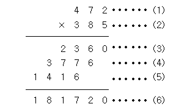

> 백준 입출력과 사칙연산 단계에 해당하는 1번부터 13번에 해당하는 문제에 대한 풀이입니다. 사용한 언어는 **_JavaScript(NodeJS)_** 입니다.

## 단계 1. Hello World (문제번호 : 2557)

#### \* 문제 : Hello World!를 출력하시오.

```javascript
console.log('Hello World!')
```

결과 : `성공`

## 단계 2. A + B (문제번호 : 1000)

#### \* 문제 : 두 정수 A와 B를 입력받은 다음, A+B를 출력하는 프로그램을 작성하시오.

- 입력 : 첫째 줄에 A와 B가 주어진다. (0 < A, B < 10)
- 출력 : 첫째 줄에 A+B를 출력한다.

```javascript
const fs = require('fs')
const inputData = fs.readFileSync(0).toString().split(' ')

const A = parseInt(inputData[0])
const B = parseInt(inputData[1])

console.log(A + B)
```

<br/>

#### \* 문제 풀이

1. 백준에서 입력되어 있는 값을 가져오기 위해서는, Node.js의 내장 모듈인 **파일 시스템(fs)** 모듈을 통해 값을 가져옵니다. 이 모듈은 파일 읽기, 쓰기 등의 작업을 수행할 수 있게 해줍니다.

```javascript
const fs = require('fs')
```

2.  fs모듈에서 가져온 값을 readFileSync 함수로 파일의 내용을 읽어와야하는데, 괄호 안의 변수로부터 데이터를 읽어와야하는 것을 의미합니다.<br/>
    **첫번째**, '/dev/stdin'는 Unix 또는 Linux 시스템에서 표준 입력을 나타내는 경로 입니다. 다시 말해, 사용자로부터의 입력을 읽어오는 것을 의미합니다. Node.js에서는 이를 다시 '0'으로 간단하게 표현할 수 있습니다.<br/>
    **두번째**, 첫번째에서 말한 것과 같이 '/dev/stdin' 대신 0을 사용하여 함수를 작성할 수 있습니다.<br/>
    **세번째**, toString()메소드를 사용하여 문자열로 변환하는 대신 'utf8'를 두번째 변수로 넣어 디코딩된 문자열로 반환하게 할 수 있습니다.<br/> 📍세가지 경우 중 첫번째 경우의 시간 소요가 가장 컸기 때문에 나머지 두 경우 중 직관적으로 알기 편한 두번째 경우를 사용했습니다 <abbr title="'/dev/stdin'를 사용하면 Node.js가 해당 경로를 찾아가는데 시간이 걸릴 수 있습니다. 
    반면 0을 사용하면 Node.js는 즉시 표준 입력 스트림에 접근할 수 있습니다. 
    백준에서는 두번째와 세번째의 경우 시간소요가 같게 나왔습니다. 이론적으로는 세번째의 경우가 'utf8'을 지정해 Node.js는 파일의 내용을 읽은 후에 문자열로 변환하는 추가 작업을 수행할 필요가 없으므로 이 과정이 더 빠르다고 할 수 있습니다. 그러나 백준에서는 그 차이가 나타나지 않고 나타나더라도 미미하기 때문에 가독성을 위해 저는 두번째 방식을 선택했습니다.">[보기]</abbr> <br/>
    .split(' ')은 입력 받은 문자열을 배열화 하는대 사용됩니다. ' '사이 공백이 있으므로 공백을 기준으로 문자열을 배열화합니다. 예를들어 입력 된 문자열이 "1 2"이라면 inputData는 ["1", "2"]이라는 배열이 되는 것 입니다.<br/> \*\* **변수명은 inputData와 같이 직관적으로 알 수 있게 설정하는 것이 좋습니다.**

```javascript
const inputData = fs.readFileSync('/dev/stdin').toString().split(' ')
or
const inputData = fs.readFileSync(0).toString().split(' ')
or
const inputData = fs.readFileSync(0, 'utf8').split(' ')
```

3. parseInt 함수를 사용하여 inputData에 저장된 문자열을 정수로 변환합니다. 배열에서 첫번쨰는 0부터 count됩니다.

```javascript
const A = parseInt(inputData[0])
const B = parseInt(inputData[1])
```

<br/>

결과 : `성공`

## 단계 3. A - B (문제번호 : 1001)

#### \* 문제 : 두 정수 A와 B를 입력받은 다음, A-B를 출력하는 프로그램을 작성하시오.

- 입력 : 첫째 줄에 A와 B가 주어진다. (0 < A, B < 10)
- 출력 : 첫째 줄에 A-B를 출력한다.

```javascript
const fs = require('fs')
const inputData = fs.readFileSync(0).toString().split(' ')

const A = parseInt(inputData[0])
const B = parseInt(inputData[1])

console.log(A - B)
```

결과 : `성공`
<br/>

## 단계 4. A x B (문제번호 : 10998)

#### \* 문제 : 두 정수 A와 B를 입력받은 다음, A x B를 출력하는 프로그램을 작성하시오.

- 입력 : 첫째 줄에 A와 B가 주어진다. (0 < A, B < 10)
- 출력 : 첫째 줄에 AxB를 출력한다.

```javascript
const fs = require('fs')
const inputData = fs.readFileSync(0).toString().split(' ')

const A = parseInt(inputData[0])
const B = parseInt(inputData[1])

console.log(A * B)
```

<br/>

#### \* 문제 풀이

1. 곱셈은 ' x '가 아닌 ' \* '기호를 사용합니다.

   <br/>
결과 : `성공`
<br/>

## 단계 5. A / B (문제번호 : 1008)

#### \* 문제 : 두 정수 A와 B를 입력받은 다음, A/B를 출력하는 프로그램을 작성하시오.

- 입력 : 첫째 줄에 A와 B가 주어진다. (0 < A, B < 10)
- 출력 : 첫째 줄에 A/B를 출력한다. 실제 정답과 출력값의 절대오차 또는 상대오차가 10-9 이하이면 정답이다.

```javascript
const fs = require('fs')
const inputData = fs.readFileSync(0).toString().split(' ')

const A = parseInt(inputData[0])
const B = parseInt(inputData[1])

console.log(A / B)
```

<br/>

#### \* 문제 풀이

1. 나눗셈은 ' \ '기호를 사용합니다.

<br/>

결과 : `성공`
<br/>

## 단계 6. 사칙연산 (문제번호 : 10869)

#### \* 문제 : 두 자연수 A와 B가 주어진다. 이때, A+B, A-B, A\*B, A/B(몫), A%B(나머지)를 출력하는 프로그램을 작성하시오.

- 입력 : 첫째 줄에 A와 B가 주어진다. (0 < A, B < 10)
- 출력 : 첫째 줄에 A+B, 둘째 줄에 A-B, 셋째 줄에 A\*B, 넷째 줄에 A/B, 다섯째 줄에 A%B를 출력한다.

```javascript
const fs = require('fs')
const inputData = fs.readFileSync(0).toString().split(' ')

const A = parseInt(inputData[0])
const B = parseInt(inputData[1])

console.log(A + B)
console.log(A - B)
console.log(A * B)
console.log(parseInt(A / B))
console.log(A % B)
```

<br/>

#### \* 문제 풀이

1. 출력 조건에서 원하는 순서대로 console.log값을 입력해주면 됩니다.

<br/>

결과 : `성공`
<br/>

## 단계 7. ??! (문제번호 : 10926)

#### \* 문제 : 준하는 사이트에 회원가입을 하다가 joonas라는 아이디가 이미 존재하는 것을 보고 놀랐다. 준하는 놀람을 ??!로 표현한다. 준하가 가입하려고 하는 사이트에 이미 존재하는 아이디가 주어졌을 때, 놀람을 표현하는 프로그램을 작성하시오.

- 입력 : 첫째 줄에 준하가 가입하려고 하는 사이트에 이미 존재하는 아이디가 주어진다. 아이디는 알파벳 소문자로만 이루어져 있으며, 길이는 50자를 넘지 않는다.
- 출력 : 첫째 줄에 준하의 놀람을 출력한다. 놀람은 아이디 뒤에 ??!를 붙여서 나타낸다.

```javascript
const fs = require('fs')
const ID = fs.readFileSync(0).toString().trim()

console.log(`${ID}??!`)
```

<br/>

#### \* 문제 풀이

1. 해당 문제의 경우 입력 데이터가 여러 개가 아닌 하나의 문자열을 입력받기 때문에 split(" ")을 활용해 배열화하는 과정이 필요없습니다. 대신 trim()을 사용해서 문자열 양 옆에 존재하는 공백을 지워줘야 합니다.trim()을 사용하지 않으면 정답이 아닙니다.

<br/>

결과 : `성공`
<br/>

## 단계 8. 1998년생인 내가 태국에서는 2541년생?! (문제번호 : 18108)

#### \* 문제 : ICPC Bangkok Regional에 참가하기 위해 수완나품 국제공항에 막 도착한 팀 레드시프트 일행은 눈을 믿을 수 없었다. 공항의 대형 스크린에 올해가 2562년이라고 적혀 있던 것이었다.불교 국가인 태국은 불멸기원(佛滅紀元), 즉 석가모니가 열반한 해를 기준으로 연도를 세는 불기를 사용한다. 반면, 우리나라는 서기 연도를 사용하고 있다. _불기 연도가 주어질 때 이를 서기 연도로 바꿔 주는 프로그램을 작성하시오._

- 입력 : 서기 연도를 알아보고 싶은 불기 연도 y가 주어진다. (1000 ≤ y ≤ 3000)
- 출력 : 불기 연도를 서기 연도로 변환한 결과를 출력한다.

```javascript
const fs = require('fs')
const inputData = fs.readFileSync(0).toString().trim()

console.log(parseInt(inputData) - 543)
```

<br/>

#### \* 문제 풀이

1. 해당 문제의 경우도 입력 데이터가 여러 개가 아니기에 split(" ")을 활용해 배열화하는 과정이 필요없고, trim()을 사용해서 문자열 양 옆에 존재하는 공백을 지워줘야 합니다.

<br/>

결과 : `성공`
<br/>

## 단계 9. 나머지 (문제번호 : 10430)

#### \* 문제 : (A+B)%C는 ((A%C) + (B%C))%C 와 같을까? (A×B)%C는 ((A%C) × (B%C))%C 와 같을까? 세 수 A, B, C가 주어졌을 때, 위의 네 가지 값을 구하는 프로그램을 작성하시오.

- 입력 : 첫째 줄에 A, B, C가 순서대로 주어진다. (2 ≤ A, B, C ≤ 10000)
- 출력 : 첫째 줄에 (A+B)%C, 둘째 줄에 ((A%C) + (B%C))%C, 셋째 줄에 (A×B)%C, 넷째 줄에 ((A%C) × (B%C))%C를 출력한다

```javascript
const fs = require('fs')
const inputData = fs.readFileSync(0).toString().split(' ')

const A = parseInt(inputData[0])
const B = parseInt(inputData[1])
const C = parseInt(inputData[2])

console.log((A + B) % C)
console.log(((A % C) + (B % C)) % C)
console.log((A * B) % C)
console.log(((A % C) * (B % C)) % C)
```

<br/>

결과 : `성공`
<br/>

## 단계 10. 곱셈 (문제번호 : 2588)

#### \* 문제 :(세 자리 수) × (세 자리 수)는 다음과 같은 과정을 통하여 이루어진다.



#### (1)과 (2)위치에 들어갈 세 자리 자연수가 주어질 때 (3), (4), (5), (6)위치에 들어갈 값을 구하는 프로그램을 작성하시오.

- 입력 : 첫째 줄에 (1)의 위치에 들어갈 세 자리 자연수가, 둘째 줄에 (2)의 위치에 들어갈 세자리 자연수가 주어진다.
- 출력 : 첫째 줄부터 넷째 줄까지 차례대로 (3), (4), (5), (6)에 들어갈 값을 출력한다.

```javascript
const fs = require('fs')
const inputData = fs.readFileSync(0).toString().split('\n')

const A = parseInt(inputData[0])
const B = parseInt(inputData[1])

console.log(A * (B % 10))
console.log(A * parseInt((B % 100) / 10))
console.log(A * parseInt(B / 100))
console.log(A * B)
```

<br/>

#### \* 문제 풀이

1. split('\n')는 줄바꿈 문자를 기준으로 문자열을 분리하여 배열화합니다.

2. (3)은 A와 B의 1의 자리와 곱한 값을 나타내기 때문에 B를 10으로 나눈 나머지 값과 A를 곱한 값을 출력해줍니다.

```javascript
console.log(A * (B % 10))
```

3. (4)은 A와 B의 10의 자리와 곱한 값을 나타내기 때문에 B를 100으로 나눈 나머지 값에 다시 10으로 나눠 몫값을 구하여 A를 곱한 값을 출력해줍니다.

```javascript
console.log(A * parseInt((B % 100) / 10))
```

4. (5)은 A와 B의 100의 자리와 곱한 값을 나타내기 때문에 B를 100으로 나눈 몫 값에 A를 곱한 값을 출력해줍니다.

```javascript
console.log(A * parseInt(B / 100))
```

5. (6)은 A와 B를 곲한 값을 출력 해 줍니다.

```javascript
console.log(A * B)
```

<br/>

결과 : `성공`
<br/>

## 단계 11. 꼬마 정민 (문제번호 : 11382)

#### \* 문제 : 꼬마 정민이는 이제 A + B 정도는 쉽게 계산할 수 있다. 이제 A + B + C를 계산할 차례이다!

- 입력 : 첫 번째 줄에 A, B, C (1 ≤ A, B, C ≤ 1012)이 공백을 사이에 두고 주어진다.
- 출력 : A+B+C의 값을 출력한다.

```javascript
const fs = require('fs')
const inputData = fs.readFileSync(0).toString().split(' ')

const A = parseInt(inputData[0])
const B = parseInt(inputData[1])
const C = parseInt(inputData[2])

console.log(A + B + C)
```

<br/>

결과 : `성공`
<br/>

## 단계 12. 고양이 (문제번호 : 10171)

#### \* 문제 : 아래 예제와 같이 고양이를 출력하시오.

- 입력 : 없음.
- 출력 : 고양이를 출력한다.

```javascript
console.log('\\    /\\')
console.log(" )  ( ')")
console.log('(  /  )')
console.log(' \\(__)|')
```

<br/>

#### \* 문제 풀이

1. console.log에 한줄씩 출력되는 문자를 입력해주면 됩니다.
2. 역슬래시(\)를 문자로 출력하고 싶을 때, \\와 같이 두개를 연속해서 적어야 하나의 역슬래시가 인식됩니다.

<br/>

결과 : `성공`
<br/>

## 단계 13. 개 (문제번호 : 10172)

#### \* 문제 : 아래 예제와 같이 개를 출력하시오.

- 입력 : 없음.
- 출력 : 개를 출력한다.

```javascript
console.log('|\\_/|')
console.log('|q p|   /}')
console.log('( 0 )"""\\')
console.log('|"^"`    |')
console.log('||_/=\\\\__|')
```

<br/>

#### \* 문제 풀이

1. console.log를 통해 괄호 안의 값을 출력할 때 작은따옴표('')혹은 큰따옴표("")로 값을 감싼 후 값을 출력 할 수 있습니다. 큰따옴표나 작은따옴표를 문자로 출력하고 싶을 경우에 두 가지 방법을 사용할 수 있습니다.<br/>
   **첫번째**, 큰따옴표는 \ 뒤에 큰따옴표(")를 붙이고, 작은따옴표는 \ 뒤에 작은따옴표(')를 붙여 해당 문자를 출력할 수 있습니다.<abbr title='코드 블록에서 *를 붙인 이유와 설명에서 \" 대신 풀어서 설명한 이유는 VSCode에서는 자동으로 \" 를 "로 변환 해주기 때문입니다.
   VSCode에서 따옴표 설정을 변경할 수 있으나, 괄호 또는 ""를 수동으로 닫아야 하는 불편함이 발생 할 수 있기 때문에 지양하는 것이 좋습니다.'>📍[보기]</abbr><br/>
   **두번째**, 그냥 연속해서 작성하면 됩니다. 단, 작은따옴표로 값을 감쌌을 때, """를 입력해도 문제가 되지 않지만 큰따옴표로 감싼 경우에는 에러가 발생합니다. 그래서 연속해서 작성하고 싶은 경우 큰따옴표를 작은따옴표로 바꿔주어야 합니다. 큰따옴표로 감싼 경우에도 경우도 같습니다.<br/>

```javascript
* console.log('( 0 )\"\"\"\\')
or
console.log('( 0 )"""\\')

```

   <br/>

결과 : `성공`

- 백준코딩 단계 별 풀어보기 Step1 입출력과 사칙연산 링크

  [<https://www.acmicpc.net/step/1>](https://www.acmicpc.net/step/1)
