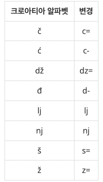
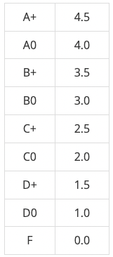

> 백준 심화1 단계 중 1번부터 8번 문제에 대한 풀이입니다. 사용한 언어는 **_JavaScript(NodeJS)_** 입니다. 각 단계에 사용한 프로그래밍 문법에 대한 설명은 각 단계별로 구분한 페이지에 설명되어 있습니다.

## 단계 1. 새싹 (문제번호 : 25083)

#### \* 문제 : 아래 예제와 같이 새싹을 출력하시오.

- 입력 : 입력은 없다.
- 출력 : 새싹을 출력한다.

```javascript
console.log('         ,r\'"7')
console.log("r`-_   ,'  ,/")
console.log(' \\. ". L_r\'')
console.log('   `~\\/')
console.log('      |')
console.log('      |')
```

<br/>

#### \* 문제 풀이

1. 원하는 기호가 출력이 안되는경우 출력을 원하는 기호 앞에 \를 붙입니다. \출력 원할 경우 -> \\ 입력<br/>
   (입출력과 사칙연산 단계13 설명 참고)

결과 : `성공`

## 단계 2. 킹, 퀸, 룩, 비숍, 나이트, 폰 (문제번호 : 3003)

#### \* 문제 : 동혁이는 오래된 창고를 뒤지다가 낡은 체스판과 피스를 발견했다. 체스판의 먼지를 털어내고 걸레로 닦으니 그럭저럭 쓸만한 체스판이 되었다. 하지만, 검정색 피스는 모두 있었으나, 흰색 피스는 개수가 올바르지 않았다. 체스는 총 16개의 피스를 사용하며, 킹 1개, 퀸 1개, 룩 2개, 비숍 2개, 나이트 2개, 폰 8개로 구성되어 있다. 동혁이가 발견한 흰색 피스의 개수가 주어졌을 때, 몇 개를 더하거나 빼야 올바른 세트가 되는지 구하는 프로그램을 작성하시오.

- 입력 : 첫째 줄에 동혁이가 찾은 흰색 킹, 퀸, 룩, 비숍, 나이트, 폰의 개수가 주어진다. 이 값은 0보다 크거나 같고 10보다 작거나 같은 정수이다.

- 출력 : 첫째 줄에 입력에서 주어진 순서대로 몇 개의 피스를 더하거나 빼야 되는지를 출력한다. 만약 수가 양수라면 동혁이는 그 개수 만큼 피스를 더해야 하는 것이고, 음수라면 제거해야 하는 것이다.

```javascript
const fs = require('fs')
const inputData = fs.readFileSync(0).toString().trim().split(' ').map(Number)
const pieces = [1, 1, 2, 2, 2, 8]

let result = Array(6).fill(0)

for (i = 0; i < 6; i++) {
  result[i] = pieces[i] - inputData[i]
}
console.log(result.join(' '))
```

결과 : `성공` :: 반복문단계와 1차원 배열단계를 응용한 문제입니다

## 단계 3. 별 찍기 - 7 (문제번호 : 2444)

#### \* 문제 : 예제를 보고 규칙을 유추한 뒤에 별을 찍어 보세요.

- 입력 : 첫째 줄에 N(1 ≤ N ≤ 100)이 주어진다.
- 출력 : 첫째 줄부터 2×N-1번째 줄까지 차례대로 별을 출력한다.

```javascript
const fs = require('fs')
const inputData = fs.readFileSync(0).toString().trim()
const N = parseInt(inputData)

for (let i = 1; i <= N; i++) {
  let str = ' '.repeat(N - i) + '*'.repeat(2 * i - 1)
  console.log(str)
}

for (let i = N - 1; i >= 1; i--) {
  let str = ' '.repeat(N - i) + '*'.repeat(2 * i - 1)
  console.log(str)
}
```

<br/>

#### \* 문제 풀이

1. 별이 출력되는 부분을 반으로 나눠서 반복문을 만들었습니다. i++로 *이 증가하는 반복문과 i--로 *이 감소하는 반복문으로 나눴습니다

```javascript
for (let i = 1; i <= N; i++)
...
for (let i = N - 1; i >= 1; i--)
```

2. '\*'이 가운데 정렬이 되어야 하기 때문에 ' '.repeat(N - i)을 사용해서 앞에 공백문자 ' '를 추가해서 별들을 정렬했습니다

```javascript
let str = ' '.repeat(N - i) + '*'.repeat(2 * i - 1)
...
let str = ' '.repeat(N - i) + '*'.repeat(2 * i - 1)
```

결과 : `성공` :: 반복문단계 응용한 문제입니다.
<br/>

## 단계 4. 팰린드롬인지 확인하기 (문제번호 : 10988)

#### \* 문제 : 알파벳 소문자로만 이루어진 단어가 주어진다. 이때, 이 단어가 팰린드롬인지 아닌지 확인하는 프로그램을 작성하시오. 팰린드롬이란 앞으로 읽을 때와 거꾸로 읽을 때 똑같은 단어를 말한다. level, noon은 팰린드롬이고, baekjoon, online, judge는 팰린드롬이 아니다.

- 입력 : 첫째 줄에 단어가 주어진다. 단어의 길이는 1보다 크거나 같고, 100보다 작거나 같으며, 알파벳 소문자로만 이루어져 있다.

- 출력 : 첫째 줄에 팰린드롬이면 1, 아니면 0을 출력한다.

```javascript
const fs = require('fs')
const inputData = fs.readFileSync(0).toString().trim()
let isPalindrome = true

for (let i = 0; i < inputData.length / 2; i++) {
  if (inputData[i] !== inputData[inputData.length - i - 1]) {
    isPalindrome = false
    break
  }
}

console.log(isPalindrome ? '1' : '0')
```

<br/>

#### \* 문제 풀이

1. isPalindrome가 true일때는 '1'을 출력하고, false일때는 '0'을 출력한다라는 의미입니다.

```javascript
console.log(isPalindrome ? '1' : '0')
```

결과 : `성공` :: 반복문과 조건문을 응용한 문제입니다.
<br/>

## 단계 5. 단어 공부 (문제번호 : 1157)

#### \* 문제 : 알파벳 대소문자로 된 단어가 주어지면, 이 단어에서 가장 많이 사용된 알파벳이 무엇인지 알아내는 프로그램을 작성하시오. 단, 대문자와 소문자를 구분하지 않는다.

- 입력 : 첫째 줄에 알파벳 대소문자로 이루어진 단어가 주어진다. 주어지는 단어의 길이는 1,000,000을 넘지 않는다.
- 출력 : 첫째 줄에 이 단어에서 가장 많이 사용된 알파벳을 대문자로 출력한다. 단, 가장 많이 사용된 알파벳이 여러 개 존재하는 경우에는 ?를 출력한다.

```javascript
const fs = require('fs')
const inputData = fs.readFileSync(0).toString().trim().toUpperCase().split('')

const result = {}
inputData.forEach(letter => {
  if (result[letter]) {
    result[letter]++
  } else {
    result[letter] = 1
  }
})
const maxCount = Math.max(...Object.values(result))

const maxLetters = Object.keys(result).filter(
  letter => result[letter] === maxCount,
)

console.log(maxLetters.length > 1 ? '?' : maxLetters[0])
```

<br/>

#### \* 문제 풀이

1. 각 알파벳의 등장 횟수를 저장할 객체를 {}를 사용하여 생성합니다. <abbr title="객체(Object) : 객체는 키-값 쌍의 모음입니다. 객체는 중괄호 {}를 사용하여 생성하며, 각 키-값 쌍은 콜론으로 구분되고, 키-값 쌍들은 쉼표로 구분됩니다. 키는 일반적으로 문자열이며, 값은 어떠한 자료형이든 될 수 있습니다. ex) let student = {name:'John', age: 20}">📍[보기]</abbr> result를 객체로 설정하는 이유는 각 알파벳을 키로, 해당 알파벳의 등장 횟수를 값으로 저장하기 위함입니다.

```javascript
const result = {}
```

2. 해당 알파벳이 result 객체에 이미 존재한다면, 그 값을 1 증가시킵니다. 그렇지 않다면, 해당 알파벳을 키로 하는 새로운 속성을 만들고 값을 1로 설정합니다.

```javascript
if (result[letter]) {
  result[letter]++
} else {
  result[letter] = 1
}
```

3. Object.keys(), Object.values(), Object.entries() 등은 모두 JavaScript의 내장 함수로, Object 객체에서 사용할 수 있습니다. 여기서 Object.values(result) 함수는 result의 속성 값들을 배열로 반환합니다. 배열로 변환한 값들 중에 가장 큰 값을 반환합니다.

```javascript
const maxCount = Math.max(...Object.values(result))
```

4.  Object.keys(result) 함수는 result의 속성 이름(키)들을 배열로 반환합니다. result 객체의 모든 키 중, 그 키의 값이 maxCount와 같은 키만을 선택해 새 배열을 만듭니다.

```javascript
const maxLetters = Object.keys(result).filter(
  letter => result[letter] === maxCount,
)
```

5.  가장 많이 사용된 알파벳이 여러 개라면 '?'를, 아니라면 그 알파벳을 출력합니다.

```javascript
console.log(maxLetters.length > 1 ? '?' : maxLetters[0])
```

결과 : `성공`
<br/>

## 단계 6. 크로아티아 알파벳 (문제번호 : 2941)

#### \* 문제 : 예전에는 운영체제에서 크로아티아 알파벳을 입력할 수가 없었다. 따라서, 다음과 같이 크로아티아 알파벳을 변경해서 입력했다.



#### 예를 들어, ljes=njak은 크로아티아 알파벳 6개(lj, e, š, nj, a, k)로 이루어져 있다. 단어가 주어졌을 때, 몇 개의 크로아티아 알파벳으로 이루어져 있는지 출력한다. dž는 무조건 하나의 알파벳으로 쓰이고, d와 ž가 분리된 것으로 보지 않는다. lj와 nj도 마찬가지이다. 위 목록에 없는 알파벳은 한 글자씩 센다.

- 입력 : 첫째 줄에 최대 100글자의 단어가 주어진다. 알파벳 소문자와 '-', '='로만 이루어져 있다. 단어는 크로아티아 알파벳으로 이루어져 있다. 문제 설명의 표에 나와있는 알파벳은 변경된 형태로 입력된다.

- 출력 : 입력으로 주어진 단어가 몇 개의 크로아티아 알파벳으로 이루어져 있는지 출력한다.

```javascript
const fs = require('fs')
let inputData = fs.readFileSync(0).toString().trim()

const croatian = ['c=', 'c-', 'dz=', 'd-', 'lj', 'nj', 's=', 'z=']

croatian.forEach(alphabet => {
  inputData = inputData.split(alphabet).join(' ')
})
console.log(inputData.length)
```

<br/>

#### \* 문제 풀이

1. inputData 문자열에서 현재 크로아티아 알파벳(alpha)를 찾아 공백으로 대체해줍니다. inputData에서 croatian에 해당되지 않는 문자는 그냥 문자로 둡니다. 크로아티아 알파벳이 공백으로 대체되기 때문에 공백을 포함한 문자열의 갯수를 세어 답을 구할 수 있습니다.

```javascript
inputData = inputData.split(alphabet).join(' ')
```

결과 : `성공`
<br/>

## 단계 7. 그룹 단어 체커 (문제번호 : 1316)

#### \* 문제 : 그룹 단어란 단어에 존재하는 모든 문자에 대해서, 각 문자가 연속해서 나타나는 경우만을 말한다. 예를 들면, ccazzzzbb는 c, a, z, b가 모두 연속해서 나타나고, kin도 k, i, n이 연속해서 나타나기 때문에 그룹 단어이지만, aabbbccb는 b가 떨어져서 나타나기 때문에 그룹 단어가 아니다. 단어 N개를 입력으로 받아 그룹 단어의 개수를 출력하는 프로그램을 작성하시오.

- 입력 : 첫째 줄에 단어의 개수 N이 들어온다. N은 100보다 작거나 같은 자연수이다. 둘째 줄부터 N개의 줄에 단어가 들어온다. 단어는 알파벳 소문자로만 되어있고 중복되지 않으며, 길이는 최대 100이다.
- 출력 : 첫째 줄에 그룹 단어의 개수를 출력한다.

```javascript
const fs = require('fs')
const inputData = fs.readFileSync(0).toString().trim().split('\n')
const N = parseInt(inputData[0])

let count = 0

for (let i = 1; i < N + 1; i++) {
  const word = inputData[i]
  const checker = {}
  let isGroupWord = true
  for (let j = 0; j < word.length; j++) {
    if (checker[word[j]] && word[j] !== word[j - 1]) {
      isGroupWord = false
      break
    }
    checker[word[j]] = true
  }
  if (isGroupWord) {
    count++
  }
}
console.log(count)
```

<br/>

#### \* 문제 풀이

1. 각 문자의 등장 여부를 확인 할 객체를 초기화합니다. 각 문제에 대한 형태를 확인해야하기 때문에 객체{} 형태로 만들어야 합니다.

```javascript
const checker = {}
```

2. 처음에는 true로 설정하고, 그룹 단어가 아니라는 것이 확인되면 false로 변경됩니다.

```javascript
let isGroupWord = true
```

3. 만약 현재 문자가 이전에 등장했었고, 바로 이전 문자와 다르다면 현재 단어는 그룹 단어가 아니기때문에 false를 출력해주고 break해줍니다.
   예를들어, aba라는 단어를 확인할때 3번째 a 순서를 보면 a는 이전에 등장했고, 바로 이전 문자는 b로 a가 아니기 때문에 isGroupWord = false가 됩니다.

```javascript
if ((checker[word[j]]) && (word[j] !== word[j - 1])){
  isGroupWord = false
  break}
```

4. checker 객체에 word[j] 문자를 키(key)로 하는 속성을 추가하고, 그 값(value)을 true로 설정해줍니다. 예를들어, word가 "aba"이라고 하면, 첫 번째 루프에서 checker["a"] = true가 되며, checker 객체는 이제 {"a": true}가 됩니다.

```javascript
checker[word[j]] = true
```

5. for루프를 다 돌고난 후에 isGroupWord가 현재 true에 있다면 count에 1을 더해줍니다.

```javascript
if (isGroupWord) {
  count++
}
```

결과 : `성공`
<br/>

## 단계 8. 너의 평점은 (문제번호 : 25206)

#### \* 문제 : 인하대학교 컴퓨터공학과를 졸업하기 위해서는, 전공평점이 3.3 이상이거나 졸업고사를 통과해야 한다. 그런데 아뿔싸, 치훈이는 깜빡하고 졸업고사를 응시하지 않았다는 사실을 깨달았다! 치훈이의 전공평점을 계산해주는 프로그램을 작성해보자. 전공평점은 전공과목별 (학점 × 과목평점)의 합을 학점의 총합으로 나눈 값이다. 인하대학교 컴퓨터공학과의 등급에 따른 과목평점은 다음 표와 같다.



#### P/F 과목의 경우 등급이 P또는 F로 표시되는데, 등급이 P인 과목은 계산에서 제외해야 한다. 과연 치훈이는 무사히 졸업할 수 있을까?

- 입력 : 20줄에 걸쳐 치훈이가 수강한 전공과목의 과목명, 학점, 등급이 공백으로 구분되어 주어진다.
- 출력 : 치훈이의 전공평점을 출력한다. 정답과의 절대오차 또는 상대오차가 \(10^{-4}\) 이하이면 정답으로 인정한다.

```javascript
const fs = require('fs')
const inputData = fs.readFileSync(0).toString().trim().split('\n')
const scoreMapping = {
  'A+': 4.5,
  A0: 4.0,
  'B+': 3.5,
  B0: 3.0,
  'C+': 2.5,
  C0: 2.0,
  'D+': 1.5,
  D0: 1.0,
  F: 0.0,
}

let totalCredit = 0 // 총 학점
let totalScore = 0 // 총 점수

for (let i = 0; i < 20; i++) {
  const [subject, credit, grade] = inputData[i].split(' ')
  if (grade === 'P') continue
  totalCredit += Number(credit)
  totalScore += scoreMapping[grade] * Number(credit)
}

console.log(totalScore / totalCredit)
```

<br/>

#### \* 문제 풀이

1. scoreMapping로 등급에 따른 점수를 객체로 정의해줍니다.

```javascript
const scoreMapping = {
  'A+': 4.5,
  A0: 4.0,
  'B+': 3.5,
  B0: 3.0,
  'C+': 2.5,
  C0: 2.0,
  'D+': 1.5,
  D0: 1.0,
  F: 0.0,
}
```

2. 각 과목을 구성하는 요소(과목명, 학점, 등급)를 분리합니다.

```javascript
const [subject, credit, grade] = inputData[i].split(' ')
```

3. 만약 등급이 'P'이면 이 과목은 계산에서 제외하고 다음 반복으로 넘어갑니다.

```javascript
 if (grade === 'P') continue
```

4. 등급이 'P'가 아니면, 해당 과목의 학점을 totalCredit에 더하고, 해당 과목의 학점과 등급에 해당하는 점수의 곱을 totalScore에 더합니다.

```javascript
totalCredit += Number(credit)
totalScore += scoreMapping[grade] * Number(credit)
```

결과 : `성공`

<br/>
<br/>

- 백준코딩 단계 별 풀어보기 Step6 심화1 링크

  [<https://www.acmicpc.net/step/52>](https://www.acmicpc.net/step/52)
