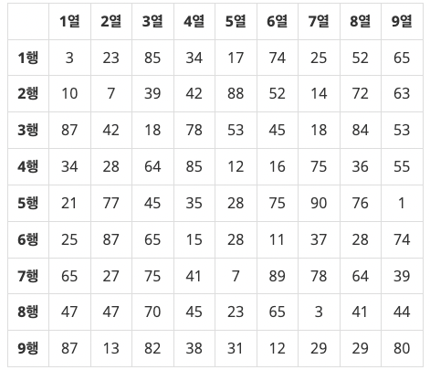
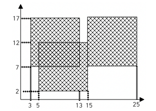

> 백준 2차원 배열 단계에 중 1번부터 4번에 해당하는 문제에 대한 풀이입니다. 사용한 언어는 **_JavaScript(NodeJS)_** 입니다.

## 단계 1. 행렬 덧셈 (문제번호 : 2738)

#### \* 문제 : N\*M크기의 두 행렬 A와 B가 주어졌을 때, 두 행렬을 더하는 프로그램을 작성하시오.

- 입력 : 첫째 줄에 행렬의 크기 N 과 M이 주어진다. 둘째 줄부터 N개의 줄에 행렬 A의 원소 M개가 차례대로 주어진다. 이어서 N개의 줄에 행렬 B의 원소 M개가 차례대로 주어진다. N과 M은 100보다 작거나 같고, 행렬의 원소는 절댓값이 100보다 작거나 같은 정수이다.
- 출력 : 첫째 줄부터 N개의 줄에 행렬 A와 B를 더한 행렬을 출력한다. 행렬의 각 원소는 공백으로 구분한다.

```javascript
const fs = require('fs')
const inputData = fs.readFileSync(0).toString().trim().split('\n')
const [N, M] = inputData[0].split(' ').map(Number)

let matrixA = []
let matrixB = []

for (let i = 1; i < N + 1; i++) {
  matrixA.push(inputData[i].split(' ').map(Number))
}
for (let j = N + 1; j < N * 2 + 1; j++) {
  matrixB.push(inputData[j].split(' ').map(Number))
}

let result = new Array(N).fill(0).map(() => new Array(M).fill(0))

for (let i = 0; i < N; i++) {
  for (let j = 0; j < M; j++) {
    result[i][j] = matrixA[i][j] + matrixB[i][j]
  }
}

for (let i = 0; i < N; i++) {
  console.log(result[i].join(' '))
}
```

<br/>

#### \* 문제 풀이

1. 첫번째 행렬 A와 두번째 행렬 B를 저장할 배열을 초기화 해줍니다.

   ```javascript
   let matrixA = []
   let matrixB = []
   ```

2. inputData에서 각각의 행렬안의 데이터를 가져온 후 초기화한 행렬에 push해줍니다.

   ```javascript
   for (let i = 1; i < N + 1; i++) {
     matrixA.push(inputData[i].split(' ').map(Number))
   }
   for (let j = N + 1; j < N * 2 + 1; j++) {
     matrixB.push(inputData[j].split(' ').map(Number))
   }
   ```

3. 결과 행렬을 저장할 배열을 초기화 해줍니다. 초기화 된 배열의 형태는
   [ [ 0, 0, 0 ], [ 0, 0, 0 ], [ 0, 0, 0 ] ] 가 됩니다.

```javascript
let result = new Array(N).fill(0).map(() => new Array(M).fill(0))
```

결과 : `성공`

## 단계 2. 최댓값 (문제번호 : 2566)

#### \* 문제 : <그림 1>과 같이 9×9 격자판에 쓰여진 81개의 자연수 또는 0이 주어질 때, 이들 중 최댓값을 찾고 그 최댓값이 몇 행 몇 열에 위치한 수인지 구하는 프로그램을 작성하시오. 예를 들어, 다음과 같이 81개의 수가 주어지면



#### 이들 중 최댓값은 90이고, 이 값은 5행 7열에 위치한다.

- 입력 : 첫째 줄부터 아홉 번째 줄까지 한 줄에 아홉 개씩 수가 주어진다. 주어지는 수는 100보다 작은 자연수 또는 0이다.

- 출력 : 첫째 줄에 최댓값을 출력하고, 둘째 줄에 최댓값이 위치한 행 번호와 열 번호를 빈칸을 사이에 두고 차례로 출력한다. 최댓값이 두 개 이상인 경우 그 중 한 곳의 위치를 출력한다.

```javascript
const fs = require('fs')
const inputData = fs.readFileSync(0).toString().trim().split('\n')

let matrix = []

for (let i = 0; i < 9; i++) {
  matrix.push(inputData[i].split(' ').map(Number))
}

let max = 0
let maxPosition = [0, 0]

for (let i = 0; i < 9; i++) {
  for (let j = 0; j < 9; j++) {
    if (matrix[i][j] >= max) {
      max = matrix[i][j]
      maxPosition = [i + 1, j + 1]
    }
  }
}

console.log(max)
console.log(...maxPosition)
```

<br/>

#### \* 문제 풀이

1. 초반에 matrix[i][j] > max를 사용해서 보다 더 큰 수가 나오면 max가 그 큰 수로 저장되는 조건으로 했습니다. 그러나 >=을 붙여야 한다는 걸 알게되었습니다. 만약 모든 원소가 0인 배열을 가진다고 한다면 matrix[i][j] > max라는 조건은 false라는 값을 반환하기 때문에 maxPosition이 갱신되지 않고 초기값인 0,0을 유지하기 때문입니다.

   ```javascript
   if (matrix[i][j] >= max) {
     max = matrix[i][j]
     maxPosition = [i + 1, j + 1]
   }
   ```

결과 : `성공`

## 단계 3. 세로읽기 (문제번호 : 10798)

#### \* 문제 : 아직 글을 모르는 영석이가 벽에 걸린 칠판에 자석이 붙어있는 글자들을 붙이는 장난감을 가지고 놀고 있다. 이 장난감에 있는 글자들은 영어 대문자 ‘A’부터 ‘Z’, 영어 소문자 ‘a’부터 ‘z’, 숫자 ‘0’부터 ‘9’이다. 영석이는 칠판에 글자들을 수평으로 일렬로 붙여서 단어를 만든다. 다시 그 아래쪽에 글자들을 붙여서 또 다른 단어를 만든다. 이런 식으로 다섯 개의 단어를 만든다. 아래 그림 1은 영석이가 칠판에 붙여 만든 단어들의 예이다.

A A B C D D <br/>
a f z z<br/>
0 9 1 2 1<br/>
a 8 E W g 6<br/>
P 5 h 3 k x<br/>
<그림 1>

#### 한 줄의 단어는 글자들을 빈칸 없이 연속으로 나열해서 최대 15개의 글자들로 이루어진다. 또한 만들어진 다섯 개의 단어들의 글자 개수는 서로 다를 수 있다.

#### 심심해진 영석이는 칠판에 만들어진 다섯 개의 단어를 세로로 읽으려 한다. 세로로 읽을 때, 각 단어의 첫 번째 글자들을 위에서 아래로 세로로 읽는다. 다음에 두 번째 글자들을 세로로 읽는다. 이런 식으로 왼쪽에서 오른쪽으로 한 자리씩 이동 하면서 동일한 자리의 글자들을 세로로 읽어 나간다. 위의 그림 1의 다섯 번째 자리를 보면 두 번째 줄의 다섯 번째 자리의 글자는 없다. 이런 경우처럼 세로로 읽을 때 해당 자리의 글자가 없으면, 읽지 않고 그 다음 글자를 계속 읽는다. 그림 1의 다섯 번째 자리를 세로로 읽으면 D1gk로 읽는다. 그림 1에서 영석이가 세로로 읽은 순서대로 글자들을 공백 없이 출력하면 다음과 같다 : Aa0aPAf985Bz1EhCz2W3D1gkD6x<br/>

#### 칠판에 붙여진 단어들이 주어질 때, 영석이가 세로로 읽은 순서대로 글자들을 출력하는 프로그램을 작성하시오.

- 입력 : 총 다섯줄의 입력이 주어진다. 각 줄에는 최소 1개, 최대 15개의 글자들이 빈칸 없이 연속으로 주어진다. 주어지는 글자는 영어 대문자 ‘A’부터 ‘Z’, 영어 소문자 ‘a’부터 ‘z’, 숫자 ‘0’부터 ‘9’ 중 하나이다. 각 줄의 시작과 마지막에 빈칸은 없다.
- 출력 : 영석이가 세로로 읽은 순서대로 글자들을 출력한다. 이때, 글자들을 공백 없이 연속해서 출력한다.

```javascript
const fs = require('fs')
const inputData = fs.readFileSync(0).toString().trim().split('\n')

let result = ''

for (let i = 0; i < 15; i++) {
  for (let j = 0; j < 5; j++) {
    if (inputData[j][i]) {
      result += inputData[j][i]
    }
  }
}

console.log(result)
```

<br/>

#### \* 문제 풀이

1. 결과값은 문자열로 출력되기 때문에 ' '로 초기화 해줍니다.

```javascript
let result = ''
```

2. 이 조건문은 현재 읽고 있는 위치 i에 해당 단어 j의 글자가 있는지 확인합니다. 만약 글자가 없다면(undefined이라면), 이 글자는 건너뛰고 다음 단어의 글자를 계속 읽습니다. 현재 읽고 있는 글자가 있다면, 이를 result 문자열의 끝에 추가합니다.

```javascript
if (inputData[j][i]) {
  result += inputData[j][i]
}
```

결과 : `성공`
<br/>

## 단계 4. 색종이 (문제번호 : 2563)

#### \* 문제 : 가로, 세로의 크기가 각각 100인 정사각형 모양의 흰색 도화지가 있다. 이 도화지 위에 가로, 세로의 크기가 각각 10인 정사각형 모양의 검은색 색종이를 색종이의 변과 도화지의 변이 평행하도록 붙인다. 이러한 방식으로 색종이를 한 장 또는 여러 장 붙인 후 색종이가 붙은 검은 영역의 넓이를 구하는 프로그램을 작성하시오.



#### 예를 들어 흰색 도화지 위에 세 장의 검은색 색종이를 그림과 같은 모양으로 붙였다면 검은색 영역의 넓이는 260이 된다.

- 입력 : 첫째 줄에 색종이의 수가 주어진다. 이어 둘째 줄부터 한 줄에 하나씩 색종이를 붙인 위치가 주어진다. 색종이를 붙인 위치는 두 개의 자연수로 주어지는데 첫 번째 자연수는 색종이의 왼쪽 변과 도화지의 왼쪽 변 사이의 거리이고, 두 번째 자연수는 색종이의 아래쪽 변과 도화지의 아래쪽 변 사이의 거리이다. 색종이의 수는 100 이하이며, 색종이가 도화지 밖으로 나가는 경우는 없다

- 출력 : 첫째 줄에 색종이가 붙은 검은 영역의 넓이를 출력한다.

```javascript
const fs = require('fs')
const inputData = fs.readFileSync(0).toString().trim().split('\n')
const N = parseInt(inputData[0])

const paper = Array.from({ length: 100 }, () => Array(100).fill(0))
let area = 0

for (let i = 1; i < N + 1; i++) {
  const [x, y] = inputData[i].split(' ').map(Number)
  for (let j = x; j < x + 10; j++) {
    for (let k = y; k < y + 10; k++) {
      if (paper[j][k] === 0) {
        paper[j][k] = 1
        area += 1
      }
    }
  }
}

console.log(area)
```

<br/>

#### \* 문제 풀이

1. 가로세로의 크기가 100인 도화지를 0으로 채운 100x100 크기의 2차원 배열을 생성해줍니다. 0이 아닌 1은 색종이 한칸의 위치를 나타냅니다. area는 색종이가 차지하는 면적 변수입니다.

```javascript
const paper = Array.from({ length: 100 }, () => Array(100).fill(0))
let area = 0
```

2. 색종이가 차지하는 10x10 크기의 영역을 반복합니다.

```javascript
 for (let j = x; j < x + 10; j++) {
    for (let k = y; k < y + 10; k++) {
```

3. 만약 현재 위치가 흰색 도화지라면 (값이 0이라면), 이 위치를 색종이로 바꾸고 (paper[j][k] = 1), 색종이가 차지하는 면적을 1 늘립니다 (area += 1;).

```javascript
if (paper[j][k] === 0) {
  paper[j][k] = 1
  area += 1
}
```

결과 : `성공`

<br/>
<br/>

- 백준코딩 단계 별 풀어보기 Step7 2차원 배열 링크

  [<https://www.acmicpc.net/step/2>](https://www.acmicpc.net/step/2)
