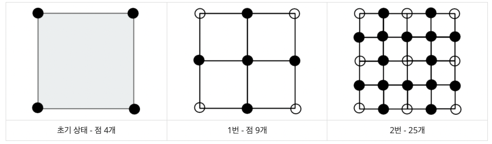
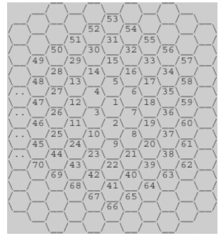
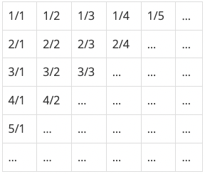

> 백준 일반 수학 1 단계 중 1번부터 7번 문제에 대한 풀이입니다. 사용한 언어는 **_JavaScript(NodeJS)_** 입니다.

## 단계 1. 진법 변환 (문제번호 : 2745)

#### \* 문제 : B진법 수 N이 주어진다. 이 수를 10진법으로 바꿔 출력하는 프로그램을 작성하시오. 10진법을 넘어가는 진법은 숫자로 표시할 수 없는 자리가 있다. 이런 경우에는 다음과 같이 알파벳 대문자를 사용한다. A: 10, B: 11, ..., F: 15, ..., Y: 34, Z: 35

- 입력 : 첫째 줄에 N과 B가 주어진다. (2 ≤ B ≤ 36) B진법 수 N을 10진법으로 바꾸면, 항상 10억보다 작거나 같다.

- 출력 : 첫째 줄에 B진법 수 N을 10진법으로 출력한다.

```javascript
const fs = require('fs')
const inputData = fs.readFileSync(0).toString().trim().split(' ')
const [N, B] = inputData
const result = parseInt(N, B)
console.log(result)
```

<br/>

#### \* 문제 풀이

1. 처음엔 주어진 A: 10, B: 11, ..., F: 15, ..., Y: 34, Z: 35을 배열로 만들어 알파벳 문자를 해당하는 숫자로 변환하는 작업을 거치는 로직을 구현해야 한다고 생각했습니다. 그러나 간단한 방법이 있었기에 위와 같이 문제를 풀이했습니다.

2. parseInt함수는 JavaScript의 내장 함수로, 문자열을 특정 진법의 정수로 변환합니다. 함수의 형식은 parseInt(string, radix)입니다.

   - string : 필수 매개변수로, 변환하려는 문자열을 나타냅니다.
   - radix : 선택 매개변수로, string이 나타내는 숫자의 진법을 나타냅니다. 2부터 36까지의 범위를 가집니다.(입력 조건에서 (2 ≤ B ≤ 36)라고 조건을 명시해줬기 때문에 내장함수인 parseInt를 활용한다는 것을 알 수 있습니다.)

3. parseInt함수는 10진법을 넘어가는 진법에서 알파벳 대문자를 자동으로 해당하는 숫자로 해석하기 때문에 알파벳문자를 해당하는 숫자로 변환하는 로직을 구현하지 않아도 됩니다.
   <br/>
   <br/>

결과 : `성공`

## 단계 2. 진법 변환 2 (문제번호 : 11005)

#### \* 문제 : 10진법 수 N이 주어진다. 이 수를 B진법으로 바꿔 출력하는 프로그램을 작성하시오. 10진법을 넘어가는 진법은 숫자로 표시할 수 없는 자리가 있다. 이런 경우에는 다음과 같이 알파벳 대문자를 사용한다. A: 10, B: 11, ..., F: 15, ..., Y: 34, Z: 35

- 입력 : 첫째 줄에 N과 B가 주어진다. (2 ≤ B ≤ 36) N은 10억보다 작거나 같은 자연수이다.

- 출력 : 첫째 줄에 10진법 수 N을 B진법으로 출력한다.

```javascript
const fs = require('fs')
const inputData = fs.readFileSync(0).toString().trim().split(' ')
const [N, B] = inputData.map(input => parseInt(input))

const result = N.toString(B).toUpperCase()
console.log(result)
```

<br/>

#### \* 문제 풀이

1. 단계1 문제와 같이 숫자를 문자열로 변환하는 JavaScript의 내장 메소드를 활용할 수 있습니다. Number.prototype.toString() 메소드에 진법을 전달하면 해당 진법으로 숫자를 변환한 후 문자열로 반환해줍니다. 이때 중요한 조건은 입력된 진법을 정확하게 표현할 수 있는 범위가 2부터 36사이라는 점입니다. 이 범위를 벗어나면 에러가 발생하지만 문제의 입력 조건으로 (2 ≤ B ≤ 36)가 주어졌기 때문에 내장 메소드를 활용하여 문제를 해결할 수 있습니다.

2. 즉, 숫자'N'을 'B'진법으로 변환한 결과를 문자열로 반환한다는 의미로 볼 수 있습니다. 결과는 대문자로 반환해야하기 때문에 toUpperCase를 사용해줍니다.

```javascript
N.toString(B).toUpperCase()
```

   <br/>
   <br/>

결과 : `성공`

## 단계 3. 세탁소 사장 동혁 (문제번호 : 2720)

#### \* 문제 : 미국으로 유학간 동혁이는 세탁소를 운영하고 있다. 동혁이는 최근에 아르바이트로 고등학생 리암을 채용했다. 동혁이는 리암에게 실망했다. 리암은 거스름돈을 주는 것을 자꾸 실수한다. 심지어 $0.5달러를 줘야하는 경우에 거스름돈으로 $5달러를 주는것이다! 어쩔수 없이 뛰어난 코딩 실력을 발휘해 리암을 도와주는 프로그램을 작성하려고 하지만, 디아블로를 하느라 코딩할 시간이 없어서 이 문제를 읽고 있는 여러분이 대신 해주어야 한다. 거스름돈의 액수가 주어지면 리암이 줘야할 쿼터(Quarter, $0.25)의 개수, 다임(Dime, $0.10)의 개수, 니켈(Nickel, $0.05)의 개수, 페니(Penny, $0.01)의 개수를 구하는 프로그램을 작성하시오. 거스름돈은 항상 $5.00 이하이고, 손님이 받는 동전의 개수를 최소로 하려고 한다. 예를 들어, $1.24를 거슬러 주어야 한다면, 손님은 4쿼터, 2다임, 0니켈, 4페니를 받게 된다.

- 입력 : 첫째 줄에 테스트 케이스의 개수 T가 주어진다. 각 테스트 케이스는 거스름돈 C를 나타내는 정수 하나로 이루어져 있다. C의 단위는 센트이다. (1달러 = 100센트) (1<=C<=500)
- 출력 : 각 테스트케이스에 대해 필요한 쿼터의 개수, 다임의 개수, 니켈의 개수, 페니의 개수를 공백으로 구분하여 출력한다.

```javascript
const fs = require('fs')
const inputData = fs.readFileSync(0).toString().trim().split('\n')
const T = parseInt(inputData[0])

for (let i = 1; i <= T; i++) {
  let C = parseInt(inputData[i])
  let Q = Math.floor(C / 25)
  C %= 25
  let D = Math.floor(C / 10)
  C %= 10
  let N = Math.floor(C / 5)
  C %= 5
  let P = C
  console.log(Q, D, N, P)
}
```

결과 : `성공`
<br/>

## 단계 4. 중앙 이동 알고리즘 (문제번호 : 2903)

#### \* 문제 : 상근이는 친구들과 함께 SF영화를 찍으려고 한다. 이 영화는 외계 지형이 필요하다. 실제로 우주선을 타고 외계 행성에 가서 촬영을 할 수 없기 때문에, 컴퓨터 그래픽으로 CG처리를 하려고 한다. 외계 지형은 중앙 이동 알고리즘을 이용해서 만들려고 한다. 알고리즘을 시작하면서 상근이는 정사각형을 이루는 점 4개를 고른다. 그 후에는 다음과 같은 과정을 거쳐서 지형을 만든다.

1. 정사각형의 각 변의 중앙에 점을 하나 추가한다.
2. 정사각형의 중심에 점을 하나 추가한다.

  <br/>

#### 초기 상태에서 위와 같은 과정을 한 번 거치면 총 4개의 정사각형이 새로 생긴다. 이와 같은 과정을 상근이가 만족할 때 까지 계속한다. 아래 그림은 과정을 총 2번 거쳤을 때까지의 모습이다.



#### 상근이는 어떤 점은 한 개 보다 많은 정사각형에 포함될 수 있다는 사실을 알았다. 메모리 소모량을 줄이기 위해서 중복하는 점을 한 번만 저장하려고 한다. 과정을 N번 거친 후 점 몇 개를 저장해야 하는지 구하는 프로그램을 작성하시오

- 입력 : 첫째 줄에 N이 주어진다. (1 ≤ N ≤ 15)

- 출력 : 첫째 줄에 과정을 N번 거친 후 점의 수를 출력한다.

```javascript
const fs = require('fs')
const N = parseInt(fs.readFileSync(0).toString().trim())

console.log((2 ** N + 1) ** 2)
```

<br/>

#### \* 문제 풀이

1. 점의 개수가 증가하는 규칙을 찾습니다. (2의 N승 + 1)에 제곱 한 결과가 규칙이라는 걸 확인 할 수 있습니다.

결과 : `성공`
<br/>

## 단계 5. 벌집 (문제번호 : 2292)

#### \* 문제



#### 위의 그림과 같이 육각형으로 이루어진 벌집이 있다. 그림에서 보는 바와 같이 중앙의 방 1부터 시작해서 이웃하는 방에 돌아가면서 1씩 증가하는 번호를 주소로 매길 수 있다. 숫자 N이 주어졌을 때, 벌집의 중앙 1에서 N번 방까지 최소 개수의 방을 지나서 갈 때 몇 개의 방을 지나가는지(시작과 끝을 포함하여)를 계산하는 프로그램을 작성하시오. 예를 들면, 13까지는 3개, 58까지는 5개를 지난다.

- 입력 : 첫째 줄에 N(1 ≤ N ≤ 1,000,000,000)이 주어진다.
- 출력 : 입력으로 주어진 방까지 최소 개수의 방을 지나서 갈 때 몇 개의 방을 지나는지 출력한다.

```javascript
const fs = require('fs')
const N = parseInt(fs.readFileSync(0).toString().trim())

let mok = 1
let cnt = 1
while (N > mok) {
  mok += 6 * cnt
  cnt += 1
}
console.log(cnt)
```

<br/>

#### \* 문제 풀이

1. 벌집의 구조를 잘 보면, 중앙의 1에서부터 시작해서 바깥쪽으로 나아갈수록 각 '층'은 6의 배수만큼 방이 늘어납니다. 예를 들어, 중앙의 1을 첫 번째 '층'이라 하면, 두 번째 '층'에는 6개의 방, 세 번째 '층'에는 12개의 방, 네 번째 '층'에는 18개의 방이 있습니다. 문제에서 요구하는 것은 '중앙 1에서 N번 방까지 최소 개수의 방을 지나서 갈 때 몇 개의 방을 지나는지'이므로, 간단히 말해 N이 몇 번째 '층'에 위치하는지를 알면 됩니다. mok이 N보다 커지면 반복을 중지하고, 그때의 cnt가 바로 N이 속한 '층'을 나타냅니다. 따라서 cnt를 출력하면 문제의 답을 얻을 수 있습니다.
   <br/>
   <br/>

결과 : `성공`

## 단계 6. 분수찾기 (문제번호 : 1193)

#### \* 문제 : 무한히 큰 배열에 다음과 같이 분수들이 적혀있다.



#### 이와 같이 나열된 분수들을 1/1 → 1/2 → 2/1 → 3/1 → 2/2 → … 과 같은 지그재그 순서로 차례대로 1번, 2번, 3번, 4번, 5번, … 분수라고 하자. X가 주어졌을 때, X번째 분수를 구하는 프로그램을 작성하시오.

- 입력 : 첫째 줄에 X(1 ≤ X ≤ 10,000,000)가 주어진다.

- 출력 : 첫째 줄에 분수를 출력한다.

```javascript
const fs = require('fs')
const X = parseInt(fs.readFileSync(0).toString().trim())

let line = 0 // 대각선의 수(첫번째는 1/1 두번째는 1/2,2/1...로 수로 나타냈습니다.)
let max = 0

while (X > max) {
  line++
  max += line
}
const step = max - X
if (line % 2 === 0) {
  console.log(`${line - step}/${step + 1}`)
} else {
  console.log(`${step + 1}/${line - step}`)
}
```

<br/>

#### \* 문제 풀이

1. 분자와 분모의 합이 증가하는 규칙을 보면, 분자와 분모의 합이 2인 경우 1개의 분수를, 3인 경우 2개의 분수를, 4인 경우 3개의 분수를 가집니다. 따라서 분자와 분모의 합이 n인 경우 n-1개의 분수를 가진다고 볼 수 있습니다. 각 대각선은 분자와 분모의 합 + 1이라고 볼 수 있습니다. 예를들어 line = 2 는 분자 + 분모가 3인 경우라고 할 수 있습니다.

```javascript
let line = 0
```

2. 각 대각선의 마지막 숫자, 대각선을 따라 분수의 수는 1개, 2개, 3개, 4개, ... 순으로 증가합니다. 즉, line에 따른 max는 1, 3, 6, 10, ... 이 됩니다.

```javascript
let max = 0
```

3. X의 값이 어떤 대각선에 속하는지 찾습니다. max += line은 line의 값이 증가할 때마다 max 값을 누적해서 더하는 것입니다.

```javascript
while (X > max) {
  line++
  max += line
}
```

4. step은 입력한 X가 해당 대각선에서 몇 번째 위치에 있는지를 나타냅니다. max에서 X를 빼면 step을 구할 수 있습니다.

```javascript
const step = max - X
```

5. line이 짝수인 경우 대각선은 왼쪽 아래에서 오른쪽 위로 올라가며, 분자는 감소하고 분모는 증가합니다. 따라서 line - step이 분자가 되고 step + 1이 분모가 됩니다. 홀수인 경우는 짝수의 경우와 반대라고 볼 수 있습니다.

```javascript
if (line % 2 === 0) {
  console.log(`${line - step}/${step + 1}`)
} else {
  console.log(`${step + 1}/${line - step}`)
}
```

결과 : `성공`
<br/>

## 단계 7. 달팽이는 올라가고 싶다 (문제번호 : 2869)

#### \* 문제 : 땅 위에 달팽이가 있다. 이 달팽이는 높이가 V미터인 나무 막대를 올라갈 것이다. 달팽이는 낮에 A미터 올라갈 수 있다. 하지만, 밤에 잠을 자는 동안 B미터 미끄러진다. 또, 정상에 올라간 후에는 미끄러지지 않는다. 달팽이가 나무 막대를 모두 올라가려면, 며칠이 걸리는지 구하는 프로그램을 작성하시오.

- 입력 : 첫째 줄에 세 정수 A, B, V가 공백으로 구분되어서 주어진다. (1 ≤ B < A ≤ V ≤ 1,000,000,000)
- 출력 : 첫째 줄에 달팽이가 나무 막대를 모두 올라가는데 며칠이 걸리는지 출력한다.

```javascript
const fs = require('fs')
const inputData = fs.readFileSync(0).toString().trim().split(' ')
const [A, B, V] = inputData.map(input => parseInt(input))

let day = 0
let distance = 0

while (V > day) {
  day++
  distance += A
  if (distance >= V) {
    break
  }
  distance -= B
}

console.log(day)
```

결과 : <code class="language-text other-color">시간초과</code> :: 위 방법은 입력 범위가 너무 커서 시간초과를 초래했습니다.

```javascript
const fs = require('fs')
const inputData = fs.readFileSync(0).toString().trim().split(' ')
const [A, B, V] = inputData.map(input => parseInt(input))

let day = Math.ceil((V - A) / (A - B)) + 1

console.log(day)
```

#### \* 문제 풀이

1. 달팽이가 하루에 움직이는 거리는 A-B입니다. 마지막 날에 달팽이가 막대기 꼭대기에 도착하면 미끄러지지 않기 때문에 꼭대기까지 거리 V에서 올라갈 수 있는 A를 빼준 V-A는 올라가야하는 총거리에서 마지막 날 올라가는 거리를 빼준 거리입니다. 마지막날을 제외하고 나머지 올라가야하는 거리(V-A)를 하루에 올라갈 수 있는 거리 A-B로 나눠준 뒤 +1(마지막 날)을 해주면 달팽이가 꼭대기에 도달하는 기간을 구할 수 있습니다.

```javascript
let day = Math.ceil((V - A) / (A - B)) + 1
```

결과 : `성공`
<br/>
<br/>

- 백준코딩 단계 별 풀어보기 Step8 일반 수학 1 링크

  [<https://www.acmicpc.net/step/8>](https://www.acmicpc.net/step/8)
