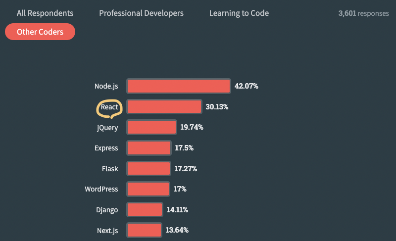

> React를 사용하는 이유와 React가 무엇인지에 대해 알아보는 것은 웹 개발 과정에서 큰 도움이 된다고 생각합니다.

### 1. React를 왜 사용하는가?

React를 사용하는 이유를 이해하기 위해서는 우선 누가 이 기술을 사용하고 있으며, 그 규모가 어느 정도인지를 알아보아야 합니다.  여러 웹사이트 중 약 절반 정도가 React.js를 사용한다고 볼 수 있습니다. 에어비엔비, 인스타그램, 넷플릭스, 페이스북과 같은 큰 기업들이 ReactJS를 사용하고 있기 때문에 큰 커뮤니티를 형성하고 있습니다. 페이스북은 ReactJS를 개발하였고, 지금도 계속해서 투자하며 발전시키고 있습니다. 한국어로 번역이 잘되어있어서 React 공식 페이지를 통해 핵심 개념과 사용 방법을 더 잘 이해할 수 있습니다. 이처럼 React를 사용하기엔 충분한 인프라가 형성되어있기 때문에 많은 곳에서 사용되고 있습니다. 
또한 JavaScript의 표준 기능을 사용하여 코드를 작성하므로, 개발자는 JavaScript의 새로운 표준을 사용하거나 다른 프레임워크나 라이브러리로 전환하는 것이 상대적으로 쉽습니다. 이러한 이유로 인해 React는 학습과정이 다른 비슷한 기술들에 비해 상대적으로 편리하다고 할 수 있습니다.

\*\* [참고] Stack Overflow Developer Survey

### 2. React란?

React는 프론트엔드 개발을 위한 JavaScript 라이브러리로, 데이터가 시간에 따라 어떻게 변화하는지에 따라 UI를 효율적으로 업데이트하고 렌더링할 수 있게 해줍니다. 웹 애플리케이션을 개발할 때, 데이터가 변경될 때마다 전체 UI를 다시 렌더링하는 것은 성능에 부담이 되며, 코드를 관리하기 어렵게 만듭니다. React는 이러한 문제를 해결하기 위해 'Virtual DOM'을 도입하였습니다. 이를 통해 계속 반복되는 코드 조각들을 재사용할 수 있으며, UI를 구성하는 문법 또한 더욱 간결하고 직관적입니다. 이러한 이유로, React는 웹 애플리케이션 뿐 아니라 모바일 애플리케이션(React Native를 통해) 개발에도 널리 사용되고 있습니다. 다음 절에서는 React의 주요 특징들을 구체적으로 설명하겠습니다.

### 3. React의 주요 특징

#### **- 빠른 렌더링**

: React는 Virtual DOM(VDOM)을 사용하여 실제 브라우저의 DOM 업데이트를 최적화합니다. 이를 통해 React는 데이터의 변화가 일어날 때마다 전체 UI를 새로 렌더링하는 대신, 변화가 발생한 부분만 업데이트하는 데 필요한 최소한의 동작을 수행합니다. React의 주요 특징 중 Virtual DOM(VDOM)을 사용한 것을 뽑은 이유는 가상 돔을 사용하여 UI를 업데이트하는 데 React에서 선두적인 역할을 하였고, 그 기법이 많은 주목을 받았기 때문입니다.  [참고] 📎 [Dom과 Virtual Dom(가상돔)이란?] (https://ellajang.github.io/frontendCoreTech/dom/)

   

#### **- React와 DOM간의 인터페이스: ReactDOM**

: 먼저 앞서 빠른 렌더링에서 설명한 VDOM와 ReactDOM은 다른 역할을 합니다. 개발자는 React를 통해 컴포넌트를 정의하고 상태를 관리하지만, 실제로 이 컴포넌트와 상태가 웹 브라우저에 표시되기 위해서는 DOM에 반영되어야 합니다. ReactDOM은 이런 과정을 쉽게 만들어주며, React 컴포넌트를 실제 DOM 요소에 마운트하고 업데이트하는 역할을 합니다. 따라서, ReactDOM은 React와 실제 DOM 사이의 '다리' 역할을 하고, Virtual DOM은 성능 최적화를 위한 방법입니다.
 
 

#### **- 컴포넌트 기반**

: React는 컴포넌트라는 독립적인 모듈을 기반으로 구축되어 있습니다. UI를 독립적이고 재사용 가능한 부분으로 분리하여 개발하고 관리할 수 있게 해줍니다. 이를 통해, 개발자는 각 컴포넌트를 개별적으로 개발하고 테스트할 수 있으며, 이를 조합하여 복잡한 UI를 구축할 수 있습니다.
 
 

#### **- 단방향 데이터 흐름(One-way data binding)**

: React는 단방향 데이터 흐름 또는 단방향 데이터 바인딩을 사용합니다. 데이터가 부모 컴포넌트에서 자식 컴포넌트로만 흐르며, 이를 통해 애플리케이션 내에서 데이터가 어떻게 변화하는지 쉽게 이해하고 예측할 수 있게 합니다. 구체적으로 설명하면, 자식 컴포넌트는 부모 컴포넌트로부터 props라는 형태로 데이터를 받아오고, 이 데이터는 읽기 전용이 됩니다. 자식 컴포넌트는 이 props를 직접 수정할 수 없으며, 데이터의 변화가 필요한 경우에는 부모 컴포넌트에게 이를 요청합니다. 이렇게 하면 애플리케이션의 상태 관리가 보다 명확해지며, 어떤 컴포넌트가 애플리케이션의 상태를 변경하였는지 쉽게 추적할 수 있게 됩니다.
 
 

#### **- JSX**

: React는 JSX라는 JavaScript를 확장한 문법을 사용합니다. JSX는 JavaScript 내부에서 HTML 구문을 작성할 수 있게 해주며, 이를 통해 개발자는 보다 직관적이고 가독성 높은 코드를 작성할 수 있게 됩니다.

### 4. 결론

React는 큰 커뮤니티, JavaScript와의 호환성, 빠른 렌더링, 컴포넌트 기반 구조, 단방향 데이터 흐름, 그리고 JSX와 같은 특징들로 인해 많은 개발자들이 선택하는 프론트엔드 라이브러리입니다. 이런 이유로 React를 많은 곳에서 사용하고 있다고 할 수 있습니다.
