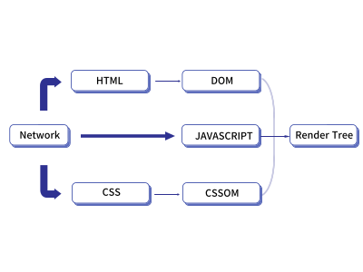

> 객체 지향 프로그래밍(Object-Oriented Programming, OOP)가 무엇인지에 대해 알아보겠습니다!

### 1. 객체 지향 프로그래밍(Object-Oriented Programming, OOP) 이란?

<!--
웹 페이지의 CSS를 JavaScript를 통해 다루기 위한 API입니다. CSSOM은 웹 페이지의 CSS를 트리 구조로 나타내는데, 이 트리 구조는 HTML DOM (Document Object Model)의 구조와 비슷합니다.  DOM이 HTML 문서를 트리 구조로 나타내는 것과 비슷하게, CSSOM은 CSS 규칙을 트리 구조로 나타냅니다. 각 CSS 규칙은 트리의 노드에 해당하며, 이 노드들은 서로 연결되어 CSSOM 트리를 형성합니다.

### 2. 객체 지향 프로그래밍의 특징

#### **- 스타일 정보에 대한 JavaScript 접근**

: CSSOM은 웹 개발자가 웹 페이지의 스타일을 동적으로 변경하도록 JavaScript에서 CSS 정보에 접근하게 합니다.

   

#### **- 동적 스타일 변경**

: CSSOM을 통해 웹 개발자는 JavaScript를 이용해 웹 페이지의 스타일을 동적으로 변경할 수 있습니다. 이는 사용자와의 상호작용에 따라 페이지의 스타일을 바꾸는 등의 동적인 웹 개발에 유용합니다.
 
 

#### **- 렌더 트리 생성에 필요**

: 웹 브라우저는 DOM과 CSSOM을 사용하여 렌더 트리를 만듭니다. 이 렌더 트리는 화면에 표시되는 노드만 포함하며, 실제로 화면에 렌더링 될 내용을 결정하는 데 사용됩니다.

### 3. 객체 지향 프로그래밍의 장단점

DOM은 HTML 문서의 구조와 내용에 관한 정보를 포함하는 반면, CSSOM은 CSS 스타일 규칙에 관한 정보를 포함합니다. 
DOM이 웹 페이지의 구조적인 부분 (텍스트, 이미지, 기타 요소 등)을 조작하는데 사용되는 반면, CSSOM은 페이지의 시각적인 부분 (색상, 레이아웃, 폰트 등)을 조작하는데 사용됩니다. 
따라서 CSSOM (CSS Object Model)과 DOM (Document Object Model)은 브라우저에서 사용하는 두 개의 별도의 데이터 구조라고 볼 수 있습니다. 
두 개의 별도의 데이터 구조이기 때문에 가상 DOM은 일반적으로 DOM의 구조만을 표현하며 CSSOM과는 별도로 관리됩니다. 
브라우저는 이 두 데이터 구조를 병합하여 **_렌더 트리_** 라는 것을 생성합니다. 렌더 트리는 DOM의 구조와 CSSOM의 스타일 정보를 결합한 것으로, 화면에 어떤 요소를 어떻게 그려야 할지 결정하는 데 사용되는 것입니다.

### 4. 렌더링 트리 형성 과정

 

#### **1) HTML 파싱 및 DOM 트리 생성**

: HTML 문서를 읽고 그에 대응하는 DOM 트리를 생성합니다. DOM 트리는 HTML 문서의 구조를 나타냅니다.
 
 

#### **2) CSS 파싱 및 CSSOM 트리 생성**

: CSS 스타일 시트를 읽고 그에 대응하는 CSSOM 트리를 생성합니다. CSSOM 트리는 CSS 선택자와 스타일을 나타냅니다.
 
 

#### **3) DOM 트리와 CSSOM 트리 결합**

: DOM 트리와 CSSOM 트리는 결합하여 렌더 트리를 생성합니다. 렌더 트리는 웹페이지의 시각적 표현을 나타내며, 각 노드에는 위치와 크기 등의 시각적 속성이 포함되어 있습니다.
 
 

#### **4) 레이아웃 단계**

: 렌더 트리를 통해 각 노드의 정확한 위치와 크기를 계산합니다. 이 단계에서는 뷰포트 내의 정확한 위치와 크기를 계산합니다.
 
 

#### **5) 페인트 단계**

: 최종 렌더 트리와 레이아웃 정보를 기반으로 실제 픽셀을 그립니다.
 
 
 -->
